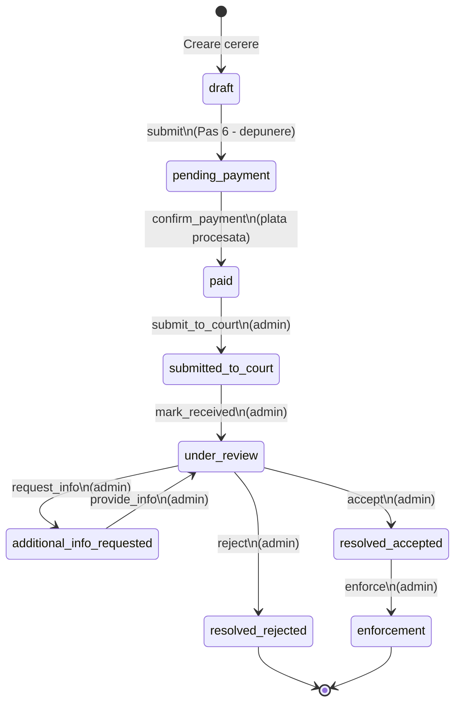

# Flux complet: Depunere cerere cu valoare redusa

## Diagrama principala

```mermaid
flowchart TD
    START([Utilizator anonim]) --> REG[/Inregistrare\n email + parola/]
    START --> LOGIN[/Autentificare/]
    START --> FORGOT[/Am uitat parola/]

    REG --> VERIFY_EMAIL{Email verificat?}
    VERIFY_EMAIL -->|Nu| CHECK_EMAIL[Verifica email-ul\n click link din email]
    CHECK_EMAIL --> VERIFY_EMAIL
    VERIFY_EMAIL -->|Da| HOME

    FORGOT --> RESET_EMAIL[Introdu email]
    RESET_EMAIL --> RESET_LINK[Primeste link resetare\n pe email]
    RESET_LINK --> RESET_PASS[Seteaza parola noua]
    RESET_PASS --> LOGIN

    LOGIN --> HOME([Dashboard utilizator])

    HOME --> NEW_CASE[Depune cerere noua]
    HOME --> MY_CASES[Dosarele mele]
    HOME --> PROFILE[Profil]

    PROFILE --> EDIT_PROFILE[Editare nume / telefon]
    PROFILE --> CHANGE_PASS[Schimbare parola]

    NEW_CASE --> STEP1

    subgraph WIZARD [" Wizard cerere - 6 pasi "]
        direction TB
        STEP1[Pas 1: Selectare instanta\n judet + judecatorie]
        STEP1 --> STEP2[Pas 2: Date reclamant\n tip PF/PJ, CNP/CUI,\n adresa, avocat]
        STEP2 --> STEP3[Pas 3: Date parat\n 1-3 parati, tip PF/PJ,\n adresa]
        STEP3 --> STEP4[Pas 4: Detalii creanta\n suma, descriere, scadenta,\n dobanda, cheltuieli judecata]
        STEP4 --> STEP5[Pas 5: Probe si martori\n descriere probe, martori,\n dezbatere orala]
        STEP5 --> STEP6[Pas 6: Confirmare\n verificare date,\n calcul taxe]
    end

    STEP6 --> SUBMIT{Depune cererea}

    SUBMIT --> FEE_CALC[Calcul taxe automat\n Taxa judiciara + Comision platforma]
    FEE_CALC --> CREATE_PAYMENTS[Creare 2 plati PENDING]
    CREATE_PAYMENTS --> GEN_PDF[Generare PDF cerere]
    GEN_PDF --> STATUS_PP[Status: pending_payment]

    STATUS_PP --> PAYMENT_PAGE[/Pagina plata\n afisare taxe/]
    PAYMENT_PAGE --> PAY{Plateste}
    PAY --> MARK_PAID[Plati: COMPLETED\n Metoda: simulator]
    MARK_PAID --> STATUS_PAID[Status: paid]

    STATUS_PAID --> ADMIN_SUBMIT

    subgraph ADMIN [" Actiuni admin "]
        direction TB
        ADMIN_SUBMIT[Trimite la instanta]
        ADMIN_SUBMIT --> STATUS_COURT[Status: submitted_to_court]
        STATUS_COURT --> ADMIN_RECEIVED[Marcheaza primit]
        ADMIN_RECEIVED --> STATUS_REVIEW[Status: under_review]
        STATUS_REVIEW --> DECISION{Decizie instanta}
        DECISION -->|Informatii\n suplimentare| STATUS_INFO[Status: additional_info_requested]
        STATUS_INFO -->|Info furnizate| STATUS_REVIEW
        DECISION -->|Admis| STATUS_ACCEPTED[Status: resolved_accepted]
        DECISION -->|Respins| STATUS_REJECTED[Status: resolved_rejected]
        STATUS_ACCEPTED --> ENFORCE{Executare silita?}
        ENFORCE -->|Da| STATUS_ENFORCE[Status: enforcement]
        ENFORCE -->|Nu| END_OK
    end

    STATUS_REJECTED --> END_FAIL([Dosar respins])
    STATUS_ENFORCE --> END_OK([Dosar finalizat])

    style WIZARD fill:#f0f7ff,stroke:#2563eb,stroke-width:2px
    style ADMIN fill:#fef3c7,stroke:#d97706,stroke-width:2px
    style START fill:#e0e7ff,stroke:#4f46e5
    style END_OK fill:#d1fae5,stroke:#059669
    style END_FAIL fill:#fee2e2,stroke:#dc2626
```



## Statusuri dosar (State Machine)



## Calcul taxe

```
Suma pretinsa          Taxa judiciara       Comision platforma    Total
-----------           ---------------      ------------------    -----
0 - 2.000 RON         50 RON               29.90 RON            79.90 RON
2.001 - 10.000 RON    250 + 2% x (suma     29.90 RON            variabil
                       - 2.000) RON

Exemplu: suma = 5.000 RON
  Taxa judiciara  = 250 + 2% x 3.000 = 250 + 60 = 310 RON
  Comision        = 29.90 RON
  Total           = 339.90 RON
```

## Autorizare pe actiuni

| Actiune | Cine | Conditie status |
|---------|------|-----------------|
| Editare cerere (wizard) | Utilizator owner | `draft` |
| Upload documente | Utilizator owner | `draft`, `pending_payment` |
| Stergere documente | Utilizator owner | `draft`, `pending_payment` |
| Plata | Utilizator owner | `pending_payment` |
| Vizualizare dosar | Utilizator owner / Admin | orice |
| Schimbare status | Admin | conform workflow |

## Entitati implicate

```
User (1) ----> (N) LegalCase ----> (1) Court
                    |
                    +----> (N) Document
                    +----> (N) Payment
                    +----> (N) CaseStatusHistory
                    +----> (N) AuditLog
```
