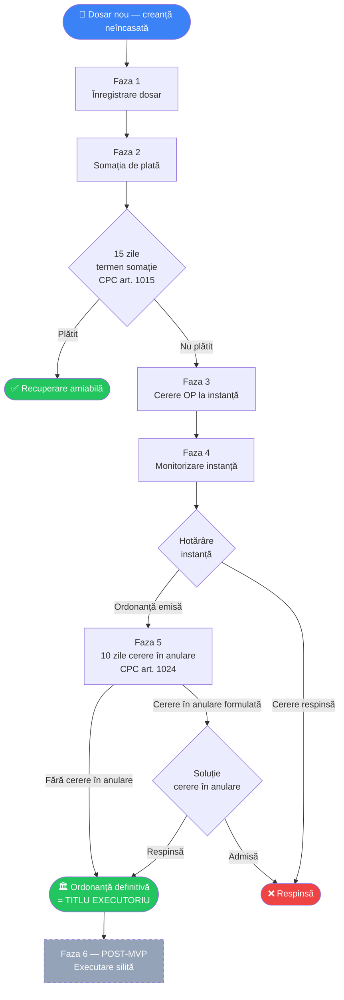
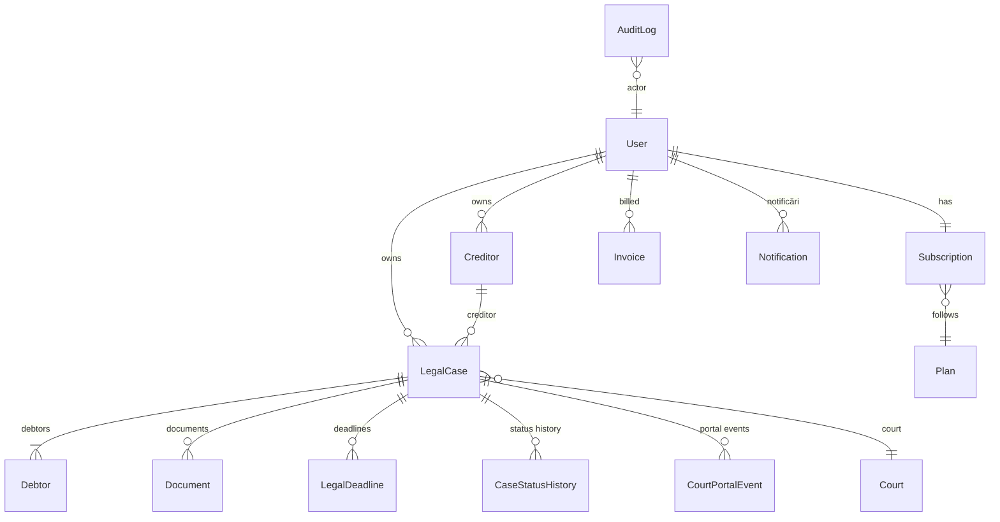
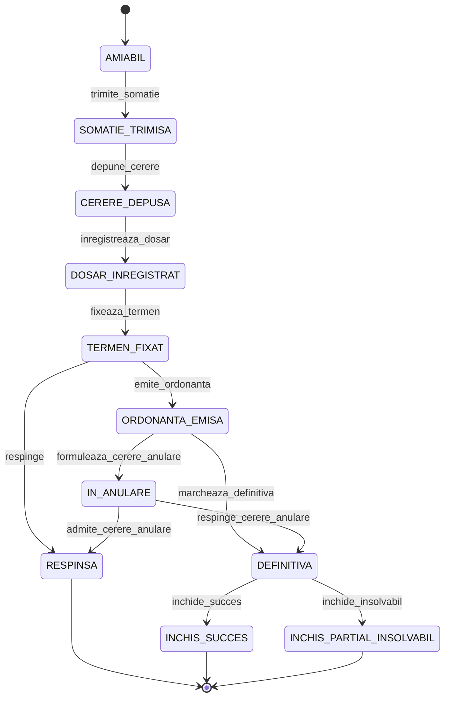

# LexRecovery — Analiză și Detaliere Fluxuri Aplicație

> **Document de specificație funcțională**
> Stack: Symfony 7.3 + PHP 8.4 + MySQL 8 + Doctrine ORM + Twig/Stimulus/Turbo + Tailwind v4
> Status: pivot de la "Cerere cu Valoare Redusă" către LexRecovery
> Versiune: **1.1 — 2026-05-09** corecții juridice in-line C1/C2/C4/C5 + N4 (vezi `ANALIZA-JURIDICA-PROCEDURA-OP-2026-05-08.md`)
> Modificări față de v1.0:
> - **C1**: termen somație 30 → **15 zile** (CPC art. 1015 alin. 1).
> - **C2**: "contestație"/"CONTESTATA"/`contesta` → "cerere în anulare"/"IN_ANULARE"/`formuleaza_cerere_anulare` (CPC art. 1024).
> - **C4**: comunicare somație — exclusiv executor judecătoresc sau Poșta Română cu conținut declarat (curier privat NU).
> - **C5**: prorogare termene la prima zi lucrătoare (CPC art. 181 alin. 2).
> - **N4**: verificare insolvență BPI = blocant (ERROR), nu warning.
> - **Citare CPC corectată**: termenul cererii în anulare = art. **1024**, nu art. 1023 (care reglementează executarea).

---

## Cuprins

1. [Viziune produs](#1-viziune-produs)
2. [Personă și jobs-to-be-done](#2-personă-și-jobs-to-be-done)
3. [Fluxul end-to-end al unui dosar](#3-fluxul-end-to-end-al-unui-dosar)
4. [Detalierea fiecărei faze](#4-detalierea-fiecărei-faze)
5. [Modelul de domeniu](#5-modelul-de-domeniu)
6. [Workflow / state machine](#6-workflow--state-machine)
7. [Calcule automate](#7-calcule-automate)
8. [Sistemul de termene](#8-sistemul-de-termene)
9. [Documente generate](#9-documente-generate)
10. [Monitorizare portal.just.ro](#10-monitorizare-portaljustro)
11. [Notificări](#11-notificări)
12. [Frontend Stack & UX Standards](#12-frontend-stack--ux-standards)
13. [Monetizare](#13-monetizare)
14. [Auth & autorizare](#14-auth--autorizare)
15. [Diferențe față de MVP-ul actual](#15-diferențe-față-de-mvp-ul-actual)
16. [Cod existent reutilizabil vs de refăcut](#16-cod-existent-reutilizabil-vs-de-refăcut)
17. [Riscuri și unknowns](#17-riscuri-și-unknowns)

---

## 1. Viziune produs

**LexRecovery** este o platformă SaaS care automatizează întregul ciclu de viață al unui dosar de recuperare creanțe prin procedura **Ordonanței de Plată** (Codul de procedură civilă, art. 1014-1025): de la primul contact cu debitorul (somația de plată) până la obținerea titlului executoriu și (post-MVP) executarea silită.

**Scopul produsului**: avocatul introduce datele dosarului o singură dată, iar aplicația preia munca repetitivă: calculează dobânda legală pe zile, taxa de timbru, generează documentele necesare (somație, cerere OP, opis, ZIP cu acte), urmărește termenele cu alerte 7/3/1 zile înainte de expirare și monitorizează zilnic portal.just.ro pentru schimbări în dosarul aflat la instanță.

**Diferențierea față de MVP-ul actual ("Cerere cu Valoare Redusă")**:
- MVP-ul actual rezolvă o singură depunere de cerere către instanță (formular Anexa 1, plata taxei judiciare, încheiere).
- LexRecovery acoperă **întregul ciclu de viață al unei creanțe**: dosar continuu pe 5-6 faze cu state machine, monitorizare activă post-depunere, generare multiple documente, sistem de termene cu alerte automate.

**Promisiunea de valoare**: un avocat poate gestiona simultan 50-100+ dosare în loc de 5-10, cu zero risc de pierdere a unui termen procedural.

---

## 2. Personă și jobs-to-be-done

**Avocat de drept comercial / civil**, cabinet individual sau membru într-un cabinet, care gestionează portofolii de creanțe pentru clienți (creditori PF/PJ).

Jobs-to-be-done:
- **Reducere muncă administrativă repetitivă**: redactare somații, cereri OP, calcule dobânzi, urmărire portal.just.ro — toate făcute manual astăzi (timp mediu 30-45 min somație, 2-3 ore cerere OP cu opis).
- **Eliminare risc pierdere termene**: termenele procedurale (15 zile somație CPC art. 1015, 10 zile cerere în anulare CPC art. 1024, 3 ani prescripție NCC art. 2517, prorogate la prima zi lucrătoare CPC art. 181) să fie monitorizate automat cu alerte multiple.
- **Vizibilitate portofoliu**: dashboard cu toate dosarele active, filtrare după status, sortare după urgență termene, sume în recuperare.
- **Documente standardizate**: PDF-uri pre-completate cu datele dosarului, format consistent, gata de descărcat și depus.

**Comparativ tipic — fără vs cu LexRecovery** (sursă `lexrecovery-prezentare-avocat.md`):

| Activitate | Manual | Cu LexRecovery |
|---|---|---|
| Redactare somație | 30-45 min | 2 min (download PDF) |
| Cerere OP + opis | 2-3 ore | 5 min (download ZIP) |
| Calcul dobânzi + taxă timbru | 15-20 min | Instant (automat) |
| Verificare portal.just.ro | Zilnic, manual | Automat (email la schimbare) |
| Urmărire termene | Agendă manuală | Automat (alerte 7/3/1 zile) |

---

## 3. Fluxul end-to-end al unui dosar



**Scope MVP**: Fazele 1-5 (până la `DEFINITIVA`). Faza 6 (executare silită + selectare executor judecătoresc + pachet executare) este rezervată post-MVP.

---

## 4. Detalierea fiecărei faze

### Faza 1 — Înregistrare dosar (status `AMIABIL`)

**Trigger**: avocatul accesează "Dosar nou" din dashboard.

**Acțiuni utilizator** (wizard 5 pași: 0 + 1-4):

0. **Documente sursă** (opțional dar puternic recomandat): avocatul încarcă contractul, factura, somația sau alte acte care conțin datele creanței. Sistem rulează **`DataExtractionService`** care extrage automat (vezi secțiunea 7.4): denumire/nume creditor și debitor + CNP/CUI + adresă + IBAN, sumă creanță + monedă + dată scadență, temei juridic + descriere. Avocatul vede preview cu valorile detectate și sursa fiecărei valori (ex: "Suma 5.000 RON detectată din contract.pdf, pagina 2"). Poate sări peste acest pas dacă vrea să introducă manual.
1. **Creditor**: pre-populat cu valorile extrase (badge "auto-completat din [doc]"). Autocomplete dintre creditori existenți sau confirmare/editare formular (PF/PJ, denumire, CNP/CUI, adresă, IBAN, telefon, email).
2. **Debitor(i)**: posibil multipli; ANAF lookup automat la blur CUI (refolosește serviciul existent `AnafLookupService`) — populează denumire + adresă + nrRegCom + status fiscal (ACTIV/INACTIV/RADIAT) + status TVA. Pre-populat din documente. Pentru insolvență (L 85/2014) avocatul verifică manual BPI (bpi.just.ro — fără API) și marchează flag `inInsolvency` + atașează PDF publicare BPI ca probă.
3. **Date creanță**: pre-populat din documente (sumă, scadență, temei). Avocatul completează `relationshipType` (`COMERCIAL` sau `CIVIL`), opțional dobândă contractuală + penalități. **Calculate live via Stimulus**: dobândă acumulată zi de zi, total creanță actualizată, taxa timbru, instanță competentă.
4. **Confirmare**: rezumat complet cu indicare clară a câmpurilor extrase automat vs introduse manual; buton "Salvează dosar".

**Automatizări sistem**:
- Generare automată `caseNumber` intern.
- Documentele uploadate la step 0 sunt persistate ca `Document` cu tip corespunzător (CONTRACT/FACTURA/ANEXA) și asociate dosarului — vor intra automat în ZIP-ul cererii OP la Faza 3.
- Creare `LegalDeadline` de tip `PRESCRIPTIE` (data scadență + 3 ani, prioritate `CRITICAL`).
- Audit log la creare + audit log la fiecare câmp pre-completat din extracție (pentru trasabilitate juridică: ce a venit din AI vs ce a introdus avocatul).

**Output**: Dosar persistat cu status `AMIABIL`, documentele sursă atașate, gata pentru emiterea somației.

---

### Faza 2 — Somația de plată (status `SOMATIE_TRIMISA`)

**Trigger**: avocatul apasă "Generează somație" în view dosar.

**Acțiuni utilizator**: descarcă PDF somație pre-completat, semnează, trimite debitorului. Marchează în aplicație "Am trimis somația la data X".

**Modalități legale de comunicare somație** (CPC art. 1015 alin. 1 — strict limitate):
1. **Prin executor judecătoresc** (recomandat pentru creanțe sensibile).
2. **Prin scrisoare recomandată cu conținut declarat (R+CD) + AR la Poșta Română** — exclusiv Poșta R oferă serviciul "conținut declarat" (oficiul poștal certifică pe duplicat conținutul exact al scrisorii — dovadă irefutabilă în instanță).

> ⚠ **Curierul privat (Cargus, FAN, DPD, etc.) NU este admisibil** ca dovadă a comunicării somației — nu oferă serviciu de conținut declarat. UI afișează memento avocat după generare PDF.

**Automatizări sistem**:
- Aplicare tranziție `trimite_somatie` → status devine `SOMATIE_TRIMISA`.
- Creare `LegalDeadline` `RASPUNS_SOMATIE` (data trimitere + **15 zile**, prorogat la prima zi lucrătoare, prioritate `HIGH`; CPC art. 1015 alin. 1 + art. 181 alin. 2).
- Generare PDF `payment_notice.html.twig` cu DomPDF, salvare ca `Document` (tip `PAYMENT_NOTICE`). Textul somației specifică verbatim "termen 15 zile de la primirea acesteia" (CPC art. 1015).
- Programare alerte automate 7/3/1 zile înainte de expirarea termenului de 15 zile.

**Output**: PDF somație, termen monitorizat, alerte email la 7/3/1 zile + alertă "expirat" dacă debitorul nu a plătit.

---

### Faza 3 — Cerere Ordonanță de Plată (statusuri `CERERE_DEPUSA` → `DOSAR_INREGISTRAT`)

**Trigger** (după 15 zile fără plată — termenul minim CPC art. 1015): avocatul apasă "Generează cerere OP".

**Pre-condiție obligatorie — verificare insolvență (Legea 85/2014)**: înainte de tranziția `depune_cerere`, `OpAdmissibilityValidator` blochează cu ERROR dacă pentru oricare debitor PJ:
- `inInsolvency = true` (cod `OP_BLOCKED_INSOLVENCY` — creanța se înscrie la masa credală, NU recuperare prin OP).
- `insolvencyCheckedAt IS NULL` sau mai vechi de 7 zile (cod `OP_INSOLVENCY_NOT_VERIFIED` / `OP_INSOLVENCY_STALE`).

UI cere checklist explicit: avocat verifică manual `bpi.just.ro`, atașează PDF extras BPI ca probă (`Document` cu type `BPI_PROOF`), bifează confirmare → set `Debitor.insolvencyCheckedAt = now()` + audit log obligatoriu category `BPI_VERIFICATION`. BPI nu are API public — verificarea rămâne manuală, dar enforcement-ul în aplicație devine blocant (NU warning).

**Acțiuni utilizator**: descarcă ZIP-ul cu pachetul complet (cerere OP + opis documente + somația trimisă + contract/facturi + calcul dobânzi). Depune dosarul fizic/electronic la instanța competentă. Primește numărul de dosar de la registratura instanței și îl introduce în aplicație.

**Automatizări sistem**:
- Aplicare tranziție `depune_cerere` → status `CERERE_DEPUSA`.
- Generare PDF `payment_order_request.html.twig` + `document_index.html.twig`.
- Construire ZIP (`CaseFilesPackager`) cu cerere + opis + toate `Document.filePath` ale dosarului.
- La introducere `courtCaseNumber` → tranziție `inregistreaza_dosar` → status `DOSAR_INREGISTRAT`. Activare monitorizare zilnică portal.just.ro.

**Output**: ZIP descărcabil pentru depunere, monitorizare portal pornită.

---

### Faza 4 — Monitorizare instanță (statusuri `TERMEN_FIXAT` → `ORDONANTA_EMISA` sau `RESPINSA`)

**Trigger**: cron zilnic 08:00 rulează `app:portal-check-all`.

**Automatizări sistem**:
- Pentru fiecare dosar cu status în setul activ (`DOSAR_INREGISTRAT`, `TERMEN_FIXAT`, `ORDONANTA_EMISA`, `IN_ANULARE`) și cu `courtCaseNumber` completat: query SOAP la portal.just.ro (refolosire `PortalJustClient` existent).
- `PortalEventDetector` compară starea curentă cu evenimentele anterioare → identifică schimbări noi.
- Persist în `CourtPortalEvent` cu deduplicare (index `case_id, event_type, eventDate`).
- Tranziții propuse automat (logate ca propuneri pentru aprobare avocat sau aplicate direct, în funcție de tipul evenimentului):
  - termen de judecată detectat → `fixeaza_termen` → status `TERMEN_FIXAT`, creare `LegalDeadline` `JUDECATA` cu data extrasă din portal.
  - hotărâre admisă → `emite_ordonanta` → status `ORDONANTA_EMISA`, creare `LegalDeadline` `CERERE_IN_ANULARE` (10 zile de la `rulingCommunicationDate`, prorogat CPC art. 181 — vezi secțiunea 8).
  - hotărâre respinsă → `respinge` → status `RESPINSA` (terminal).
  - cerere în anulare formulată (detectată în portal) → `formuleaza_cerere_anulare` → status `IN_ANULARE`.
- Email avocat: "Activitate nouă în Dosar X — [tip eveniment]".

**Acțiuni utilizator**: doar verifică email-urile și confirmă tranzițiile sensibile.

**Output**: status sincronizat cu realitatea instanței, fără verificare manuală.

---

### Faza 5 — Ordonanță definitivă (status `DEFINITIVA`)

**Trigger**:
- Manual: avocatul completează `rulingCommunicationDate` (data oficială a comunicării ordonanței către debitor) → declanșează termenul de 10 zile pentru cerere în anulare (CPC art. 1024 — "de la data înmânării sau comunicării").
- Auto: după expirarea celor 10 zile (prorogate la prima zi lucrătoare CPC art. 181 + buffer 1z) fără cerere în anulare, `app:check-deadlines` aplică `marcheaza_definitiva`. Dacă `rulingCommunicationDate IS NULL` → tranziția automată e blocată; alert avocat.

**Automatizări sistem**:
- Tranziție `marcheaza_definitiva` → status `DEFINITIVA`.
- Email avocat: "Dosar X — Ordonanță definitivă, titlu executoriu obținut".
- Creare `LegalDeadline` `PRESCRIPTIE_EXECUTARE` (3 ani de la definitivă, prioritate `MEDIUM`) — utilizat în Faza 6 post-MVP.

**Output**: titlu executoriu obținut, dosar gata pentru executare silită (post-MVP).

**Cazuri terminale**:
- `INCHIS_SUCCES`: debitor plătește în baza ordonanței definitive (avocat marchează manual).
- `INCHIS_PARTIAL_INSOLVABIL`: debitor insolvabil (status manual).
- `RESPINSA`: cerere OP respinsă sau cerere în anulare admisă (terminal).

### Faza 6 — Executare silită (POST-MVP)

Selectare executor judecătoresc partener, generare pachet executare (cerere executare + calcul actualizat + titlu executoriu + acte dosar), trimitere la executor, monitorizare încasări parțiale/integrale. Nu intră în scope-ul MVP-ului.

---

## 5. Modelul de domeniu



| Entitate | Rol | Câmpuri esențiale |
|---|---|---|
| `User` | Avocat (single-user) | email, password, firstName, lastName, **barNumber**, isVerified |
| `Court` | Judecătorie/Tribunal | name, type, county, **portalCode** (cod portal.just.ro) |
| `LegalCase` | Dosar de recuperare creanță | caseNumber, user, court, creditor, debtors, status, relationshipType, amount, calculatedInterest, stampDuty, dueDate, paymentNoticeDate, courtCaseNumber, hearingDate, finalRulingDate |
| `Creditor` | Clientul avocatului | personType, name, taxId/personalId, address, iban, email — reutilizabil între dosare |
| `Debtor` | Persoana datoare | personType, name, taxId/personalId, address, nrRegCom, **anafStatus** (ACTIV/INACTIV/RADIAT — pre-populat ANAF), anafCheckedAt, **inInsolvency** (manual din BPI), insolvencyCheckedAt, bpiProofDocument |
| `LegalDeadline` | Deadline procedural | type, deadlineDate, priority, completed, alertSent7/3/1 |
| `Document` | Document dosar | type (SOMATIE, CERERE_OP, OPIS, CONTRACT, FACTURA, ANEXA), filePath, **extractedData** (JSON nullable — date extrase automat), **extractionStatus** (PENDING/PROCESSING/COMPLETED/FAILED), **extractionConfidence** (decimal 0-1, nullable) |
| `CourtPortalEvent` | Eveniment portal.just.ro | eventType, payload, detectedAt |
| `CaseStatusHistory` | Istoric tranziții | fromStatus, toStatus, transition, performedBy |
| `AuditLog` | Audit acțiuni | actor, entity, entityId, action, payload, ip |
| `Notification` | Notificare in-app/email | user, channel, subject, body, sentAt, readAt |
| `Plan` | Pachet abonament | name, priceMonthly, includedCases, pricePerExtra |
| `Subscription` | Abonament activ | user, plan, status, currentPeriodStart/End, casesConsumed |
| `Invoice` | Factură | user, subscription, amount, type, status, paidAt |
| `InterestRateConfig` | Istoric BNR | validFrom, referenceRate — pentru calcul retroactiv dobândă |

**Observație importantă**: Single-user (un avocat per cont). Nu există entitate `Cabinet`. Dosarele aparțin direct user-ului (FK `LegalCase.user_id`). Voters verifică `legalCase.user === currentUser`.

---

## 6. Workflow / state machine

### Statusuri `CaseStatus` (12 valori)

| Status | Descriere | Terminal? |
|---|---|---|
| `AMIABIL` | Dosar creat, somație neemisă | Nu |
| `SOMATIE_TRIMISA` | Somație generată și trimisă, **15 zile** termen (CPC art. 1015) | Nu |
| `CERERE_DEPUSA` | Cerere OP generată; depusă fizic la instanță | Nu |
| `DOSAR_INREGISTRAT` | Număr dosar instanță introdus, monitorizare activă | Nu |
| `TERMEN_FIXAT` | Termen de judecată detectat în portal | Nu |
| `ORDONANTA_EMISA` | Hotărâre favorabilă, 10 zile cerere în anulare (CPC art. 1024) | Nu |
| `IN_ANULARE` | Debitor a formulat cerere în anulare (CPC art. 1024) | Nu |
| `DEFINITIVA` | Titlu executoriu obținut | Nu |
| `EXECUTARE` | (Placeholder MVP, folosit în Faza 6 post-MVP) | Nu |
| `RESPINSA` | Cerere OP respinsă sau cerere în anulare admisă | **Da** |
| `INCHIS_SUCCES` | Recuperare integrală | **Da** |
| `INCHIS_PARTIAL_INSOLVABIL` | Recuperare parțială sau debitor insolvabil | **Da** |

### Tranziții `CaseTransition`



### Tranziții automate vs manuale

| Tranziție | Mod | Trigger |
|---|---|---|
| `trimite_somatie` | Manual | Avocat apasă buton |
| `depune_cerere` | Manual | Avocat apasă buton după ce a depus fizic |
| `inregistreaza_dosar` | Manual | Avocat introduce courtCaseNumber |
| `fixeaza_termen` | **Automat** | Detectat de `PortalEventDetector` |
| `emite_ordonanta` | **Automat** | Detectat de `PortalEventDetector` |
| `respinge` | **Automat** | Detectat de `PortalEventDetector` |
| `formuleaza_cerere_anulare` | **Automat** sau Manual | Detectat din portal sau confirmat manual |
| `marcheaza_definitiva` | **Automat (timer)** | După 10 zile de la `rulingCommunicationDate` (NU `rulingDate`) fără cerere în anulare, prorogate la prima zi lucrătoare CPC art. 181 + buffer 1z, `app:check-deadlines` aplică tranziția. Blocat dacă `rulingCommunicationDate IS NULL`. |
| `respinge_cerere_anulare` | Manual | Avocat marchează după soluție instanță |
| `admite_cerere_anulare` | Manual | Avocat marchează |
| `inchide_succes` | Manual | Avocat confirmă plata |
| `inchide_insolvabil` | Manual | Avocat marchează |

---

## 7. Calcule automate

### 7.1 Dobânda legală (OG 13/2011)

**Formulă** (revizie 2026-05-08): pentru fiecare perioadă în care rata BNR a fost constantă:
```
dobanda_perioada = suma * (rata_aplicabila / 100) * zile_in_perioada / 365
```

Distincție obligatorie pe tip de dobândă (enum `InterestKind`):

**Dobânda penalizatoare** (cazul tipic OP, de la scadență la plată):
- **`COMERCIAL`** (raporturi între profesioniști — OG 13/2011 art. 3 alin. (2¹) introdus prin Legea 72/2013 art. 20): `rata_BNR + 8 puncte procentuale`.
- **`CIVIL`** (raporturi non-profesionale): formula curentă `(rata_BNR + 8) × 0,80` este **fără temei legal** — vezi nota de mai jos.

**Dobânda remuneratorie** (de la acordare până la scadență, doar pentru creanțe ce includ atare dobândă, ex. împrumut):
- **`COMERCIAL` + REMUNERATORIE** (OG 13/2011 art. 3 alin. 1): `rata_BNR`.
- **`CIVIL` + REMUNERATORIE**: la fel, fără temei pentru `× 0,80` în combinație cu factorul +8 — vezi nota.

> ⚠ **Notă revizie 2026-05-08**: Versiunea inițială conținea formula greșită `rata_BNR + 4 puncte` pentru CIVIL. Corectat la `(BNR+8)×0.80` la momentul respectiv.
>
> 🔴 **Notă revizie 2026-05-09 (C3)**: După verificare verbatim OG 13/2011 + Legea 72/2013 art. 20 (`legislatie.just.ro` doc 146555), combinația `(BNR+8) × 0.80` rămâne **fără temei legal**:
> - Factorul **+8 pp** este exclusiv pentru raporturi profesionale (B2B), per OG 13/2011 art. 3 alin. (2¹).
> - Diminuarea **× 0.80** este exclusiv pentru raporturi non-profesionale (P2P), per OG 13/2011 art. 3 alin. (3).
> - Cele 3 cazuri legale distincte: **B2B** (PEN: BNR+8 / REM: BNR) | **B2C** (PEN: BNR+4 / REM: BNR) | **P2P** (PEN: (BNR+4)×0.80 / REM: BNR×0.80).
>
> **Decizie produs (de luat la executare Pas 2.1 revizie din PLAN)**: (a) restrânge scope MVP la B2B + DomainException pentru CIVIL (recomandat); (b) implementare 3 ramuri B2B/B2C/P2P (post-MVP). Detaliu complet în `ANALIZA-JURIDICA-PROCEDURA-OP-2026-05-08.md` C3.

**Convenție de calcul**: zile elapsed (`act/365`), dobândă **simplă** (NU compusă — anatocismul cere convenție expresă conform NCC art. 1489).

**Limitări MVP**:
- Suport doar pentru creanțe **RON**. Pentru altă monedă (art. 4 OG 13/2011 — Libor/SOFR/Euribor + 8 pp sau formă curentă) → throw `\InvalidArgumentException`. Sprijin valută — post-MVP.
- Prescripția extinctivă (NCC art. 2517 — 3 ani) NU se verifică în acest serviciu — se calculează separat (vezi `PrescriptionCalculator` propus).

Serviciu: `InterestCalculatorService` consumă `InterestRateConfig` (istoric BNR) și calculează breakdown pe perioade.

**Output**: total dobândă + breakdown ([dataStart, dataEnd, nbrRate, applicableRate, zile, periodInterest]).

### 7.2 Taxa de timbru pentru ordonanță de plată (OUG 80/2013)

Conform OUG 80/2013 art. 6 alin. 2 (taxă pentru cererea privind ordonanța de plată).

> ⚠ **Validare juridică indispensabilă înainte de implementare**: forma actuală a OUG 80/2013 art. 6 alin. 2 (cu toate modificările) trebuie verificată pe legislatie.just.ro. Cea mai probabilă realitate juridică actuală: **taxă fixă 200 RON**, fără prag.
> 
> Versiunea inițială a acestui document menționa pragul `≤ 500 RON / > 500 RON` (50 RON / 200 RON) — această formă nu corespunde nici unei versiuni cunoscute a ordonanței. Forma cu praguri (50/200 RON la **2.000 RON**) a existat în versiuni anterioare. Corectat 2026-05-08.

**Recomandare MVP** (Variantă A — taxă fixă):
- **200 RON** pentru orice cerere OP (independent de valoarea creanței).

**Variantă B** (dacă verificarea juridică confirmă praguri în forma curentă a legii): ajustează valori pe text legal actualizat.

**Audit**: persistă pe `LegalCase` câmpul `stampDutyLawVersion` (string, ex: `"OUG 80/2013 art. 6 alin. 2 — text aplicabil 2026-05-01"`) populat la calcul, pentru justificare retroactivă în caz de dispute.

### 7.3 Instanța competentă

Conform CPC art. 1015 + art. 94 pct. 1 lit. k + art. 95 pct. 1 + art. 107:

**Competență valorică** (corectă în spec inițial ✓):
- Sumă ≤ **200.000 RON** → **Judecătorie**.
- Sumă > **200.000 RON** → **Tribunal**.

**Competență teritorială** (revizie 2026-05-08):
- Default (CPC art. 107): **domiciliul/sediul debitorului**.
- Match pe **localitate** (NU doar județ) folosind `Court.localitatiArondate`:
  - București: 6 sectoare = 6 judecătorii distincte; parser de adresă identifică sectorul.
  - Județe cu mai multe judecătorii (Cluj: Cluj-Napoca/Turda/Huedin/Gherla; Iași; Constanța; etc.): match pe localitate exactă pe raza teritorială.
- Dacă match e ambiguu sau lipsă → resolver returnează `CourtResolveResult` cu lista de candidate + explicație, **NICIODATĂ "prima activă" silent** (risc declinare CPC art. 130-131).

**Competență alternativă** (în afara scope-ului resolver, gestionată în wizard step 4 prin override manual):
- CPC art. 113 alin. (1) pct. 3 — locul executării obligației (la alegerea reclamantului).
- CPC art. 126 — clauză contractuală de alegere a forului.

> ⚠ Spec-ul inițial reducea decizia la "match pe județ" cu fallback "prima activă" — garanta cerere depusă la instanță necompetentă teritorial în 70%+ din cazurile reale. Corectat 2026-05-08.

Serviciu: `CompetentCourtResolver(suma, debtorCounty, debtorLocality?) → CourtResolveResult` lookup în `CourtRepository::findCandidatesByTypeAndLocality()`.

**Tribunale specializate** (Cluj/Mureș/Argeș) — NU se aplică default; necesită opt-in explicit la wizard pentru raporturi între profesioniști. Post-MVP.

### 7.4 Extracție automată date din documente sursă

**Scop**: la step 0 wizard, avocatul încarcă contracte/facturi/somații existente. Sistem extrage automat datele pentru pre-populare formulare.

**Date extrase**:
- **Creditor**: personType (inferat din format CUI vs CNP), denumire, cui, cnp, adresa, iban (dacă apare), legalRepresentative (PJ).
- **Debitor**: personType, denumire, cui, cnp, adresa.
- **Creanță**: suma, moneda, dueDate, temei juridic, descriere scurtă.
- **Metadata extracție**: confidence per câmp (0-1), document sursă, locație în document (pagina, snippet text).

**Strategie de extracție** (cascadă în 4 trepte, ordonată cost ascendent):

1. **Parser PDF text-based** (gratis, rapid, local): pentru PDF-uri cu strat de text (contracte digitale, facturi generate electronic). Folosește `smalot/pdfparser`. Heuristici (regex + structură) pentru identificarea câmpurilor uzuale (CUI: `RO?\d{2,10}`, CNP: 13 cifre cu validare checksum, sume RON: regex monedă). Confidence ridicat pentru pattern-uri clare. **`supports()`**: true doar dacă PDF are strat text utilizabil.

2. **OCR local + AI text** (cost foarte mic, local-first): pentru PDF-uri scanate, JPG, PNG. Pipeline:
   - **Tesseract OCR** (`tesseract-ocr` cu pachet limbă română `tesseract-ocr-ron`, instalat în Docker container) extrage textul brut din imagine. Pentru PDF scanat: conversie pagină cu pagină la PNG via ImageMagick înainte. Cost: zero (local).
   - **Claude API text-only** primește textul OCR + prompt structurat care cere JSON cu schema definită. Cost: ~$0.002 per document (mult mai ieftin decât vision). Acuratețe ridicată pentru text curat.
   - **Fallback regex** (dacă API key absent): aplică heuristici pe textul OCR — confidence mediu.
   - **Avantaj GDPR**: imaginea documentului rămâne pe serverul tău; doar textul OCR (anonimizabil dacă e nevoie) ajunge la Claude. Avocații sensibili la confidențialitate pot opta exclusiv pentru această treaptă (text trecut prin AI cu CNP-uri mascate `***-***-XXXX`).

3. **AI vision multimodal** (cost mediu, acuratețe maximă): fallback pentru cazuri grele — OCR produce text de calitate scăzută (scan prost, layout multi-coloană, antet scris de mână), sau treapta 1-2 returnează `globalConfidence < 0.5`. Claude vision (model `claude-sonnet-4-6` sau `claude-opus-4-7`) primește documentul direct ca imagine + prompt structurat. Cost: ~$0.01-0.05/doc.

4. **Fallback manual** (V1 dev): `StubExtractionStrategy` returnează `null` (avocatul completează manual). Activ când nici API key nu e setat și OCR nu reușește (sau dezactivat din setting cont).

**Setting per cont** (extensie pentru avocații sensibili la GDPR):
- `extractionMode`: `LOCAL_ONLY` (doar treapta 1 + OCR + regex; nimic prin AI), `BALANCED` (default — toate cele 4 trepte), `MAX_ACCURACY` (sare direct la treapta 3 — vision pentru toate scan-urile).

**Arhitectură serviciu**:
- `DataExtractionService` — orchestrator (decide treapta în funcție de `Document` și setting cont, persistă rezultatul în `Document.extractedData`, emit event `DataExtractedEvent` la finalizare).
- `ExtractionStrategyInterface` — contract (`supports(Document) bool`, `extract(Document) ExtractedDocumentData`).
- `PdfParserExtractionStrategy` — treapta 1, parser PDF text + regex.
- `OcrTextExtractionStrategy` — treapta 2, Tesseract + Claude text.
- `AiVisionExtractionStrategy` — treapta 3, Claude vision multimodal.
- `StubExtractionStrategy` — fallback dev.
- `OcrServiceInterface` cu implementare default `TesseractOcrService` (PHP wrapper sau shell exec către `tesseract` CLI). Posibilă alternativă plug-in: `GoogleVisionOcrService` (dacă avocatul preferă acuratețe mai bună la cost mai mic decât AI vision direct).
- DTO `ExtractedDocumentData` — structură rezultat (creditor, debitor, creanta, confidencePerField, sourceLocation, **rawOcrText** — text complet OCR păstrat pentru audit/re-procesare).

**Procesare async**: extracția poate dura 5-30 secunde (OCR Tesseract pe documente lungi + AI). Wizard step 0 dispatch `ExtractDataMessage` via Symfony Messenger, UI afișează spinner cu polling Turbo Stream → când `Document.extractionStatus = COMPLETED`, formularele step 1-3 se pre-populează la prima încărcare.

**Securitate / GDPR**:
- Consimțământ explicit afișat la upload, diferențiat pe trepte: "Documentul rămâne pe serverul nostru. Doar textul extras (OCR) este trimis la un serviciu AI (Anthropic) pentru extracție structurată — imaginea originală NU părăsește serverul nostru, decât dacă activați explicit modul Max Accuracy."
- Tesseract = OCR local, zero date la terți.
- Claude API: politică clară de no-retention (input-urile NU sunt folosite pentru antrenare și nu sunt persistate la Anthropic > 30 zile).
- CNP-uri detectate sunt mascate parțial în log-uri și în textul trimis la AI (treapta 2): regex pe text OCR înainte de prompt → înlocuiește CNP-uri cu placeholder, le re-mapează după răspunsul AI.
- Setting per cont `extractionMode = LOCAL_ONLY` → exclusiv treapta 1 + OCR + regex, fără AI deloc.
- DPA cu Anthropic dacă disponibil; alternativ, opțiune self-hosted LLM (Ollama + Qwen2-VL sau LLaVA) — V2 post-MVP.

**Costuri estimate** (per document tipic 2-5 pagini):
- PDF text: $0 (parser local, instant)
- PDF scanat / imagine via OCR + AI text (treapta 2): **~$0.002** (Tesseract gratis + ~500-1500 tokens text Claude Sonnet)
- Caz greu via AI vision (treapta 3): ~$0.01-0.05
- Mediu ponderat estimat: **~$0.005 per dosar** (majoritatea documentelor sunt PDF text sau scan-uri tipice).

Inclus în `casesConsumed` din planul de abonament — nu facturare separată per extracție.

---

## 8. Sistemul de termene

### Tipuri (`DeadlineType`)

| Tip | Calcul automat | Prioritate default | Sursă |
|---|---|---|---|
| `PRESCRIPTIE` | dueDate + 3 ani | `CRITICAL` | Cod civil, art. 2517 |
| `RASPUNS_SOMATIE` | paymentNoticeDate + **15 zile** (prorogat CPC art. 181) | `HIGH` | CPC art. 1015 alin. 1 |
| `DEPUNERE_CERERE` | paymentNoticeDate + 15 zile (reminder) | `MEDIUM` | Reminder operațional |
| `JUDECATA` | extras din portal.just.ro | `MEDIUM` | Detectat de `PortalEventDetector` |
| `CERERE_IN_ANULARE` | **rulingCommunicationDate** (NU rulingDate) + 10 zile, prorogat CPC art. 181 | `CRITICAL` | CPC art. **1024** alin. 1 |
| `OTHER` | manual | configurabil | Avocatul adaugă manual |

### Alerte automate

Cron `app:check-deadlines` rulează zilnic 07:00:
- Pentru fiecare termen necompletat:
  - Dacă `deadlineDate - azi == 7` și `alertSent7 == false` → email + setează flag.
  - Idem pentru 3 zile, 1 zi.
  - Dacă `deadlineDate < azi` → email "Termen expirat" cu prioritate vizuală în dashboard.

Email subject: `[LexRecovery] Termen [tip] — [N zile] — Dosar [caseNumber]`. Conține: dosar, creditor, debitor, sumă, dată limită, link către dosar.

### Prorogare la zile nelucrătoare (CPC art. 181 alin. 2)

> Citat verbatim CPC art. 181 alin. (2): *"Termenul care se sfârșește într-o zi de sărbătoare legală sau când serviciul este suspendat se va prelungi până la sfârșitul primei zile de lucru următoare."*

Toate termenele calculate (`RASPUNS_SOMATIE`, `CERERE_IN_ANULARE`, `PRESCRIPTIE`, `JUDECATA`) trec prin metoda `DeadlineService::nextWorkingDay()` care prorogă la prima zi lucrătoare următoare dacă deadline-ul cade în:
- Sâmbătă/duminică.
- Sărbători legale conform Codului Muncii art. 139: 1-2 ian, 24 ian, Vinerea Mare + Paște (calendar ortodox), 1 mai, 1 iun, Rusalii (ortodox), 15 aug, 30 nov, 1 dec, 25-26 dec.
- Zile suplimentare introduse prin OG (ex: vacanță judecătorească iulie-august) — override prin config YAML.

**Implicație critică pe `marcheaza_definitiva` (auto)**: cron-ul aplică tranziția DOAR dacă `now() >= nextWorkingDay(rulingCommunicationDate + 10 zile) + 1 zi buffer`. Mai bine întârziere 1z decât tranziție prematură care blochează o cerere în anulare validă.

---

## 9. Documente generate

| Document | Trigger | Template Twig | Tip `DocumentType` |
|---|---|---|---|
| **Somație de plată** | Tranziție `trimite_somatie` | `templates/pdf/payment_notice.html.twig` | `PAYMENT_NOTICE` |
| **Cerere Ordonanță de Plată** | Tranziție `depune_cerere` | `templates/pdf/payment_order_request.html.twig` | `PAYMENT_ORDER_REQUEST` |
| **Opis documente** | Tranziție `depune_cerere` | `templates/pdf/document_index.html.twig` | `DOCUMENT_INDEX` |
| **ZIP pachet instanță** | Tranziție `depune_cerere` | n/a (zip dinamic) | n/a (livrat ca download) |
| **Contracte/facturi** (upload) | Manual de avocat | n/a | `CONTRACT`, `INVOICE`, `ATTACHMENT` |
| **Dovadă comunicare somație** (upload) | Manual | n/a | `DELIVERY_PROOF` |
| Dosar executare silită | POST-MVP | n/a | n/a |

Toate PDF-urile generate cu **DomPDF** (deja instalat). Stocare locală în `var/uploads/cases/{id}/` (refolosire `PdfGeneratorService` existent ca bază).

ZIP-ul conține: cerere OP + opis + somație + toate documentele uploadate de avocat (contracte, facturi, corespondență, dovadă comunicare). Implementare în `CaseFilesPackager`.

---

## 10. Monitorizare portal.just.ro

**Tehnologie**: SOAP client `portalquery.just.ro/query.asmx` (deja implementat în `PortalJustClient.php`). Metoda principală: `CautareDosare2(numarDosar, codInstitutie)` → returnează șezări, soluții, căi de atac, status.

**Frecvență**: cron zilnic 08:00 — `app:portal-check-all` (refactor din `MonitorCourtCasesCommand`).

**Eligibilitate**: doar dosare cu `courtCaseNumber` completat și status în set activ (`DOSAR_INREGISTRAT`, `TERMEN_FIXAT`, `ORDONANTA_EMISA`, `IN_ANULARE`).

**Detectare evenimente** (`PortalEventDetector`):
- `HEARING_SCHEDULED` — termen nou de judecată → propune `fixeaza_termen` + creează `LegalDeadline` `JUDECATA`.
- `HEARING_COMPLETED` — ședință încheiată cu soluție → analiză soluție.
- `RULING_ISSUED` (admis/respins) — propune `emite_ordonanta` sau `respinge`.
- `APPEAL_FILED` — propune `formuleaza_cerere_anulare`.
- `CASE_INFO_UPDATE` — schimbare de detalii dosar (informativ).

**Deduplicare**: index DB `idx_portal_event_dedup (case_id, event_type, eventDate)` — același eveniment nu este înregistrat de două ori.

**Notificare**: la fiecare eveniment nou detectat → email avocat + `Notification` in-app.

**Rate limiting**: la nivel de SOAP request — sleep aleatoriu 2-5 secunde între dosare în cron, retry pe failure prin Symfony Messenger (max 3 retries).

---

## 11. Notificări

### Email tranzacțional

Folosim **Symfony Mailer** + Mailpit (dev) / Resend sau Postmark (prod, DSN în `.env`).

Triggere:
- Schimbare status major (`SOMATIE_TRIMISA`, `CERERE_DEPUSA`, `ORDONANTA_EMISA`, `DEFINITIVA`, `RESPINSA`).
- Alertă termen 7/3/1 zile + expirat.
- Eveniment nou pe portal.just.ro.
- Confirmare creare cont + reset parolă (deja implementate).

Templates Twig în `templates/emails/`: `case_status_change.html.twig`, `case_deadline_alert.html.twig`, `case_portal_event.html.twig`.

### In-app

Bell icon în header cu counter de necitite (preluat din planul vechi). Dropdown cu ultimele 10. Pagină `/notifications` cu listă paginată. Polling Stimulus la 30s.

Entity `Notification` (existent, neatins) — adăugare FK `dosar` (opțional) pentru link direct.

---

## 12. Frontend Stack & UX Standards

> **Filozofie**: experiență fluidă, predictibilă, fără page reloads — în stil SPA, dar **fără React, fără npm, fără Node.js**. Tot stack-ul rulează prin Asset Mapper + Importmap. Augmentări selective Symfony UX + Mercure pentru reactivitate complexă și push real-time.

### 12.1 Stack frontend confirmat

| Layer | Tehnologie | Scop |
|---|---|---|
| HTML/Layout | Twig + Tailwind CSS v4 | Template server-side, design system |
| **Component library** | **Preline UI (free, MIT)** | 300+ primitive Tailwind v4 (modal, dropdown, datepicker, table, tabs, badge, alert, skeleton) — fundație vizuală peste care se adaugă wrapper-e Twig + Stimulus |
| Page navigation | Turbo Drive | SPA-like, fără page reload |
| Regiuni dinamice | Turbo Frames | Tab-uri, modal-uri, formulare lazy load |
| Server push | **Mercure Hub** + Turbo Streams | Status extragere AI, notificări, evenimente portal |
| Reactivitate locală | Stimulus controllers | Comportamente JS izolate, declarative pe HTML |
| Reactivitate complexă | **Symfony UX Live Components** | Wizard step 3 (live calc dobândă/taxă), formuri cu validare instant |
| Autocomplete | **Symfony UX Autocomplete** (Tom Select wrapper) | Search creditori, instanțe |
| Iconografie | **Symfony UX Icons** (Heroicons inline) | SVG inline consistent, fără sprite-uri externe |
| Tranziții pagină | View Transitions API (Turbo 8) | Animări CSS native browser, zero JS suplimentar |
| Animații micro | Tailwind utility classes | `animate-pulse`, `transition-*` |
| Form draft persistence | Stimulus `autosave` + endpoint partial save | Recuperare wizard la reload accidental |

### 12.2 Pattern-uri UX aplicate consistent

**Skeleton loading** — în loc de spinner generic, ghost-uri cu pulse animation pe zonele care se încarcă (cards dashboard, tab-uri view dosar, listă termene). Implementare: primitiva Preline `<div class="hs-skeleton ...">` peste Tailwind `animate-pulse bg-gray-200 dark:bg-gray-700`, expusă ca Twig component `Skeleton` (vezi §12.5).

**Optimistic UI** pentru acțiuni rapide cu probabilitate mare de succes:
- Marcare termen completat → UI reflectă instant (checkbox + opacity), request fundal, revert pe error.
- Toggle citit/necitit notificare.
- Mark draft autosave.

**Toast notifications** stack bottom-right, auto-dismiss 4s. Stimulus controller `toast` randează component Preline `hs-toast` și ascultă custom event `toast:show` (variants: success/error/warning/info). Înlocuiește flash-uri full-width care întrerup vizual.

**Empty states** custom per pagină goală:
- Dashboard fără dosare → ilustrație + titlu "Începe primul dosar" + CTA primar.
- Dosar fără documente → buton mare "Încarcă primul document".
- Notificări goale → mesaj "Niciun eveniment nou".

**Form draft autosave** la wizard creare dosar:
- Stimulus `autosave` controller ascultă blur pe câmpuri.
- POST partial la endpoint `/dosar/nou/draft` care salvează în session bag fără validare strictă.
- Indicator vizual "Salvat la HH:MM" lângă header wizard.
- La reîntoarcere pe wizard (reload accidental), valorile sunt restaurate.

**Keyboard shortcuts** (Stimulus controller global pe `<body>`):
- `g d` → /dashboard
- `g n` → /dosar/nou
- `/` → focus pe search global
- `?` → modal "Help / Shortcuts"
- `esc` → close modal/dropdown/toast

**Dark mode** — Tailwind v4 prefix `dark:`. Toggle în header (Stimulus). Persistat în localStorage. Default: respectă OS preference (`prefers-color-scheme`).

**View transitions** — la navigare între pagini, Turbo 8 folosește View Transitions API automat dacă browser-ul suportă. Fade subtil 200ms. Tranziții slide pe wizard pași.

**Accesibilitate (WCAG AA)**:
- Toate butoanele și form-urile cu `aria-label` clare.
- Focus visible pe Tab navigation (outline contrastant).
- Semantic HTML (`<header>`, `<nav>`, `<main>`, `<article>`, `<aside>`).
- Mesaje de eroare anunțate via `role="alert"` și `aria-live="polite"`.
- Color contrast minim 4.5:1 (text normal), 3:1 (text mare).
- Navigare completă cu tastatura (no mouse-only interactions).

### 12.3 Real-time push via Mercure

**Mercure Hub** rulează ca container Docker separat (binar Go, ~10MB). PHP publică evenimente via HTTP, browser-ul deschide `EventSource` la hub. Înlocuiește polling-ul Turbo Streams unde latența contează.

Topics specifice LexRecovery:

| Topic | Conținut | Consumator UI |
|---|---|---|
| `case/{id}/extraction-status` | Status update extragere AI documente (PENDING → PROCESSING → COMPLETED) | Step 0 wizard — spinner devine ✓ verde fără reload |
| `case/{id}/portal-event` | Eveniment nou detectat pe portal.just.ro | View dosar tab "Activitate Portal" se update automat dacă e deschis |
| `case/{id}/status-change` | Tranziție workflow aplicată (manual sau automat) | Badge status în view dosar + dashboard |
| `user/{id}/notification` | Notificare nouă | Bell counter +1 + toast popup |
| `user/{id}/deadline-alert` | Alertă termen 7/3/1 zile | Toast urgent + sound (opțional setting) |

**Beneficiu vs polling**: zero request-uri când nimic nu se întâmplă, latență sub 1 secundă la evenimente reale, scalabil la zeci de avocați conectați simultan.

**Auth Mercure**: JWT semnat de Symfony cu topic restrictions per user (avocatul X primește doar topic-uri pentru dosarele lui).

### 12.4 Stimulus controllers comune (livrate o dată, refolosite peste tot)

| Controller | Scop |
|---|---|
| `toast` | Afișare toast + stack management |
| `autosave` | Draft save automat la blur |
| `keyboard-shortcuts` | Global shortcut listener |
| `dark-mode-toggle` | Toggle + persistă preferință |
| `optimistic-action` | Pattern UI optimistic + revert pe error |
| `mercure` | Subscribe topic via `data-mercure-topic-value` + dispatch DOM events |
| `dialog` | Modal cu focus trap, close on esc |
| `tabs` | Tab navigation cu Turbo Frames lazy-load |
| `confirm` | Confirmation dialog înainte de submit destructive |
| `skeleton` | Show/hide elemente cu `data-skeleton-target` |
| `live-calc` | Calcul live cu debounce (folosit în wizard step 3 ca fallback la Live Components) |
| `creditor-search` | Wrapper peste UX Autocomplete pentru creditori |
| `debitor-anaf-lookup` | Trigger ANAF lookup pe blur CUI |
| `extracted-data-poll` | Subscribe Mercure pentru status extragere documente |
| `preline-init` | Reinit Preline pe `turbo:load` event pentru navigare SPA-like (autoinit-ul Preline e pe `DOMContentLoaded`, care nu se emite la navigare Turbo Drive) |

### 12.5 Twig components (refolosibile)

Aceste componente sunt **wrapper-e peste primitive Preline UI** (modal, badge, card, stepper, skeleton, alert) cu logică LexRecovery-specific aplicată peste — mapări de status, calcule de urgență termene, ilustrații empty state etc. Sunt expuse ca `<twig:ComponentName>` și consumate uniform în toate paginile.

`templates/components/`:
- `EmptyState.html.twig` — pagini goale cu icon + title + description + CTA.
- `Toast.html.twig` — fragment toast renderable (peste Preline `hs-toast`).
- `StatusBadge.html.twig` — badge cu culoare per `CaseStatus` (peste Preline badge).
- `DeadlineCard.html.twig` — card termen cu prioritate vizuală (peste Preline card).
- `Stepper.html.twig` — wizard stepper 5 pași (peste Preline stepper).
- `Skeleton.html.twig` — placeholder pulsant configurabil (lines, width) (peste Preline `hs-skeleton`).
- `ConfirmDialog.html.twig` — modal confirmare cu Stimulus `confirm` controller (peste Preline `hs-overlay`).

### 12.6 Decizia componentelor UI

**Preline UI (free, MIT)** este biblioteca de componente aleasă pentru fundația vizuală. Motivele cheie:
- 300+ componente Tailwind v4 native, gratuit MIT.
- Vanilla JS fără Alpine/jQuery — coexistă curat cu Stimulus (namespace separat `data-hs-*` vs `data-controller`).
- Integrare prin importmap (Asset Mapper), fără Node.js.
- Licența MIT permite fork dacă proiectul ar stagna.

**Alternative evaluate**:
- **Flowbite (free MIT)** — respins: doar 56 componente free vs 300+ Preline; ar forța upgrade la Pro (~$269) pentru paritate.
- **Tailwind Plus (€249 lifetime)** — păstrat ca upgrade premium opțional viitor; oferă calitate vizuală referință (Tailwind Labs), dar varianta HTML-only "Elements" e relativ nouă și mai puțin testată cu Turbo. Migrare ulterioară posibilă fără refactor major (ambele HTML pur peste Tailwind v4).
- **Tabler.io** — eliminat: e Bootstrap 5, incompatibil cu stack-ul Tailwind v4.
- **From scratch pur** — eliminat: ~50-100h efort suplimentar fără valoare adăugată pentru un SaaS B2B juridic (UI-ul nu e diferențiator).

**Estimare efort fundație UI cu Preline**: ~5-7 zile (vs ~10-14 zile from scratch).

---

## 13. Monetizare

**Model hibrid**: abonament cu pachet de N dosare incluse + plată per dosar suplimentar.

| Entitate | Rol |
|---|---|
| `Plan` | Pachetele disponibile (ex: Starter — 5 dosare/lună 99 RON; Pro — 25 dosare/lună 299 RON). Configurabil în EasyAdmin. |
| `Subscription` | Abonamentul activ al avocatului: plan, status, perioadă curentă, contor `casesConsumed`. |
| `Invoice` | Factură unică: tip `subscription` (abonament lunar) sau `case_extra` (depășire pachet). |

**Logică**:
- La creare dosar nou: dacă `subscription.casesConsumed < plan.includedCases` → consumă slot din pachet, fără factură.
- Altfel → creează `Invoice` cu `type = case_extra`, `amount = plan.pricePerExtra`, status `pending`.
- La final lună (cron sau webhook gateway): se închide perioada, se generează factură subscription pentru luna următoare.

**Gateway plăți**: TBD (Stripe / Netopia / MobilPay). În MVP livrăm interfață `PaymentGatewayInterface` + `StubPaymentGateway` (marchează manual `paid`). Integrarea reală e post-MVP.

**Pagini noi**:
- `/abonament` — vede plan curent, dosare consumate, schimbă plan (V2).
- `/facturile-mele` — listă facturi cu status și download PDF.

---

## 14. Auth & autorizare

**Auth** (refolosit din MVP-ul actual):
- Email + parolă + email verification (SymfonyCasts verify-email-bundle).
- Reset parolă cu token (refolosit din `ResetPasswordController`).
- Login throttling: 5 încercări/minut (`security.yaml`).

**Single-user**: fiecare User=avocat este independent. Nu există entitate `Cabinet`. Dosarele, creditorii și debitorii aparțin direct user-ului (FK `user_id`).

**Autorizare** (Voters):
- `CaseVoter` (refolosire `CaseVoter` adaptat): permisiuni `CASE_VIEW`, `CASE_EDIT`, `CASE_TRANSITION`, `CASE_UPLOAD`. Verificare: `dosar.user_id === currentUser.id` sau `ROLE_ADMIN`.
- Aceleași reguli pentru `Creditor` și `Debtor`.

**Rate limiting** (refolosit + extins):
- `registration`: 3/oră per IP (existent).
- `forgot_password`: 3/oră per IP (existent).
- `case_creation`: 10/oră per user (existent — refolosit pentru `case_creation`).
- `document_upload`: 20/oră per user (existent).
- `company_lookup`: 10/oră per user (existent — pentru ANAF lookup în wizard step 2).

---

## 15. Diferențe față de MVP-ul actual

| Aspect | MVP actual (Cerere VR) | LexRecovery |
|---|---|---|
| **Target** | Creditori direcți | **Avocați** (mediator între creditor și instanță) |
| **Scop** | Depunere unică cerere VR | **Dosar continuu** pe 5-6 faze |
| **Documente generate** | 1 (Anexa 1) | **3-4** (somație, cerere OP, opis, ZIP) |
| **State machine** | Simplistă (9 stări legate de plata taxei) | **Specializată OP** (12 stări, tranziții automate timer + portal-driven) |
| **Calcule** | Taxa judiciară OUG 80/2013 (small claims) | **Dobândă OG 13/2011** + **taxa timbru OP** + instanță competentă |
| **Termene** | Niciun sistem dedicat | **Sistem complet**: 4 tipuri, alerte 7/3/1 + expirat, cron zilnic |
| **Monitorizare post-depunere** | Adăugată recent (parțial) | **Centrală**: cron 08:00 cu propagare automată în workflow |
| **Multi-dosar** | Nu prioritar | **Esențial**: dashboard cu filtre, sortare urgență, 50-100+ dosare |
| **Monetizare** | Plăți per dosar (taxa judiciară) | **Abonament + per dosar extra** (Plan/Subscription/Invoice) |
| **Wizard creare** | 6 pași (court, claimant, defendants, claim, evidence, confirmation) | **4 pași** (creditor, debitor(i), creanță cu calcul live, confirmare) |

---

## 16. Cod existent reutilizabil vs de refăcut

### 100% reutilizabil (zero modificări)

| Componentă | Path |
|---|---|
| `User` entity | `src/Entity/User.php` |
| `Court` entity (cu `portalCode`) | `src/Entity/Court.php` |
| `Document` entity | `src/Entity/Document.php` |
| `AuditLog` entity | `src/Entity/AuditLog.php` |
| `Notification` entity (extens cu FK Dosar) | `src/Entity/Notification.php` |
| `CaseStatusHistory` entity (rebrand intern Dosar) | `src/Entity/CaseStatusHistory.php` |
| `CourtPortalEvent` entity | `src/Entity/CourtPortalEvent.php` |
| `AuditLogService` | `src/Service/AuditLogService.php` |
| `CaseWorkflowService` | `src/Service/Case/CaseWorkflowService.php` |
| `DocumentUploadService` | `src/Service/Document/DocumentUploadService.php` |
| `CaseMonitoringService` | `src/Service/Portal/CaseMonitoringService.php` |
| `PortalJustClient` | `src/Service/Portal/PortalJustClient.php` |
| `PortalEventDetector` | `src/Service/Portal/PortalEventDetector.php` |
| `AnafLookupService` | `src/Service/Company/AnafLookupService.php` |
| Rate Limiter config (5 policies) | `config/packages/rate_limiter.yaml` |
| Auth — login, register, reset, email verification | `src/Controller/RegistrationController.php`, `ResetPasswordController.php`, `Security/EmailVerifier.php` |
| Tailwind v4 + Stimulus + Turbo + Asset Mapper | `assets/`, `config/packages/symfonycasts_tailwind.yaml` |

### Adaptare ușoară (50-90% reutilizat)

| Componentă | Adaptare |
|---|---|
| `LegalCase` → `LegalCase` | Restructurare câmpuri, scoatere JSON `defendants` în entitate proprie `Debtor` |
| `CaseVoter` → `CaseVoter` | Rename + ajustare permisiuni |
| `CaseWorkflowSubscriber` → `CaseWorkflowSubscriber` | Rename + adăugare `DeadlineCreationSubscriber` separat |
| `PdfGeneratorService` | Bază pentru `PaymentNoticeGeneratorService`, `PaymentOrderRequestGeneratorService` |
| `CaseWizardController` (referință pattern) | Pattern session bag pentru `CaseWizardController` (4 pași) |
| `MonitorCourtCasesCommand` | Refactor în `PortalCheckAllCommand` |
| Templates `templates/case/` | Folder reutilizat ca atare; conținutul refăcut pentru fluxurile LexRecovery |
| `DashboardController` | Adaptare query-uri pentru `LegalCase` |
| EasyAdmin CRUDs | Rename `LegalCaseCrudController` → `CaseCrudController` + CRUDs noi (Plan, Subscription, Invoice, InterestRateConfig) |

### De rescris/de la zero

| Componentă | Motiv |
|---|---|
| `InterestCalculatorService` | Logică complet nouă (OG 13/2011 cu istoric BNR) |
| `StampDutyCalculator` | Tarife OUG 80/2013 art. 6 (diferite de small claims) |
| `CompetentCourtResolver` | Praguri OP diferite (≤200k Judecătorie) |
| `OpAdmissibilityValidator` (CPC art. 1014, L 85/2014) — verifică ANAF status (RADIAT) + flag manual `inInsolvency` (BPI) | Validare juridică nouă (înlocuiește planul inițial `OnrcLookupService` — eliminat 2026-05-08, ONRC nu are API; date companie reuse `AnafLookupService` deja existent) |
| `DeadlineService` + `DeadlineAlertService` | Sistem complet nou |
| `DataExtractionService` + strategii (PdfParser, OcrText, AiVision, Stub) + `TesseractOcrService` + `ExtractDataMessage` handler async | **Sistem complet nou** — auto-completare date din contracte/facturi cu cascadă OCR + AI (vezi 7.4) |
| `PaymentNoticeGeneratorService`, `PaymentOrderRequestGeneratorService`, `CaseFilesPackager` | Generatoare noi |
| Entități noi: `Creditor`, `Debtor`, `LegalDeadline`, `InterestRateConfig`, `Plan`, `Subscription`, `Invoice` | Necesare pentru noul model |
| Enum-uri noi: `CaseStatus`, `CaseTransition`, `PersonType`, `RelationshipType`, `DeadlineType`, `DeadlinePriority` | Specializate OP |
| Templates PDF: `payment_notice.html.twig`, `payment_order_request.html.twig`, `document_index.html.twig` | Documente noi |
| Wizard 4 pași complet (DTOs, Forms, Templates, Controller) | Înlocuire pentru wizard 6 pași |
| Stimulus controllers: `live-calc`, `creditor-search`, `debtor-search` | Funcționalitate live nouă |
| `SubscriptionService`, `InvoicingService`, `PaymentGatewayInterface` | Monetizare nouă |
| Workflow YAML | Refacere completă |

### De eliminat

- `TaxCalculatorService` (OUG 80/2013 small claims).
- `CaseWizardController` (6 pași) + DTOs Step1-6 + FormTypes Step1-6 + templates `_step1..6_content.html.twig`.
- Template `templates/pdf/cerere_valoare_redusa.html.twig`.
- Toate migrările existente (drop + recreate baseline).
- `Payment` entity (fuzionat în `Invoice`).
- `PaymentController` + `PaymentProcessingService` (înlocuite cu `SubscriptionController` + `InvoicingService`).

---

## 17. Riscuri și unknowns

| # | Risc | Impact | Mitigare |
|---|---|---|---|
| **R1** | ~~API ONRC public — accesibilitate și cost neclare~~ ELIMINAT 2026-05-08: ONRC nu are API oficial; openapi.ro e scraper terț neoficial. Sursa oficială pentru date companie = ANAF API (gratuit, deja integrat ca `AnafLookupService`). Pentru insolvență (BPI) — verificare manuală + atașament PDF, fără API existent. | — | — |
| **R2** | Coolify suport cron nativ pentru `app:check-deadlines` și `app:portal-check-all` | Mediu | Backup: `symfony/scheduler` bundle (in-process, fără cron extern). |
| **R3** | DomPDF suficient pentru cerere OP (layout complex cu antet instanță) | Mic | DomPDF deja instalat și folosit. Dacă apar probleme cu layout-uri complexe → migrare la Gotenberg (Docker). |
| **R4** | Taxa de timbru OP — confirmare valori exacte OUG 80/2013 art. 6 | Mic | Validare cu un avocat înainte de Pas 2.2. Hardcodare configurabilă în `parameters.yaml` ca fallback. |
| **R5** | Gateway plăți — alegere între Stripe (SaaS internațional, ușor) vs Netopia (RO, integrare grea) vs MobilPay | Mediu | Pas 8.2 livrează doar interfață + stub. Alegerea concretă nu blochează MVP-ul; integrarea reală vine ulterior. |
| **R6** | Migrarea DB la merge `lexrecovery` → `develop` (după validare) | Mare | Pe branch experimental: drop+recreate. La merge: o singură migrare baseline curată generată cu `make:migration` peste schema goală. Pierdem datele istorice MVP, dar acceptabil deoarece pivotul e strategic. |
| **R7** | Performanță cron `app:portal-check-all` la sute de dosare | Mic | Symfony Messenger queue + rate limiter (infra există). Procesare async per dosar. |
| **R8** | Ambiguitate termene legale (10 zile = zile lucrătoare sau calendaristice? data comunicării ordonanței = data certă sau dată poștă?) | Mediu | Validare juridică. Conservator: zile calendaristice + data fizică confirmată de avocat. |
| **R9** | Acuratețe extracție AI (creditor/debitor/sumă) — risc de date greșite pre-populate care induc avocatul în eroare | Mare | (a) Confidence threshold strict — câmpurile cu confidence < 0.8 NU se pre-populează automat, doar se afișează ca "sugestii". (b) Indicator vizual obligatoriu pe câmpuri auto-completate. (c) Step 4 confirmare evidențiază clar ce vine din AI. (d) Audit log per câmp (sursa: AI/manual). (e) Test set cu contracte reale înainte de release. |
| **R10** | GDPR — documentele juridice trec prin Anthropic API (terț) | Mediu | (a) **Tesseract OCR local** pe treapta 2 → doar textul (cu CNP mascat) ajunge la AI, NU imaginea. (b) Setting per cont `extractionMode = LOCAL_ONLY` → fără AI deloc. (c) Anthropic no-retention policy + DPA. (d) Consimțământ explicit la upload, diferențiat pe trepte. (e) V2: opțiune LLM self-hosted (Ollama). |
| **R11** | Cost variabil Claude API la volum mare | Mic | (a) Cascadă în 4 trepte: PdfParser (gratis) → OCR + AI text (~$0.002) → AI vision (~$0.01-0.05) doar dacă necesar. (b) Cost mediu ponderat ~$0.005/dosar, inclus în plan abonament. (c) Rate limiter `extragere_ai` pe user (ex: 50/zi). |
| **R12** | Acuratețe Tesseract pe scan-uri proaste / scriere de mână | Mic | (a) Tesseract cu pachet `tesseract-ocr-ron` (suport diacritice). (b) Confidence threshold pe text OCR (treapta 2 face fallback automat la treapta 3 dacă text OCR are < N caractere alfa-numerice clare). (c) Pre-procesare imagine (deskew, denoise) cu ImageMagick. |

---

> **Acest document este referința stabilă pentru direcția produsului LexRecovery. Schimbările de scope se reflectă întâi aici, apoi se propagă în `PLAN-DEZVOLTARE-LEXRECOVERY.md`.**
