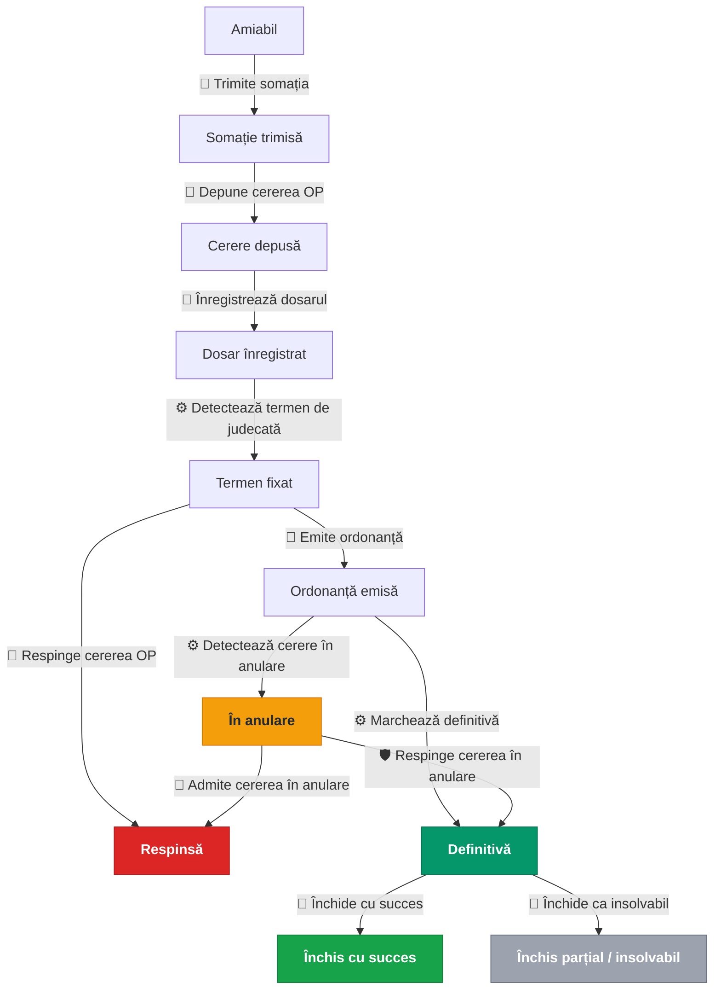

# Workflow dosar ordonanță de plată

## 1. Diagrama workflow-ului

Legendă pentru declanșator:
- 👤 = manual (avocatul apasă un buton din interfață)
- ⚙️ = automat (sistem, fără intervenție)
- 🛡 = admin-only (deocamdată fără buton dedicat în UI avocat; vezi §6)

---

## 2. Cele 11 statusuri ale dosarului

| Status | Ce înseamnă pentru avocat | Terminal? | Monitorizare portal? |
|--------|---------------------------|:---------:|:-------------------:|
| Faza amiabilă | Dosar creat. Creditorul a contactat debitorul pe cale amiabilă; somația încă nu a fost generată. | Nu | Nu |
| Somație trimisă | Somația de plată (PDF) a fost generată. Avocatul urmează să o comunice debitorului. | Nu | Nu |
| Cerere depusă | Cererea de ordonanță de plată + opisul au fost generate. Avocatul a depus pachetul la registratura instanței competente. | Nu | Nu |
| Dosar înregistrat | Avocatul a introdus în aplicație numărul de dosar primit de la instanță (format ECRIS). De aici, sistemul interoghează zilnic portalul. | Nu | **Da** |
| Termen fixat | Sistemul a detectat pe portal data ședinței de judecată. Termenul procedural e creat automat. | Nu | **Da** |
| Ordonanță emisă | Instanța a pronunțat o soluție favorabilă. Avocatul a confirmat pronunțarea în aplicație și a introdus data pronunțării. | Nu | **Da** |
| În anulare (CPC art. 1024) | Debitorul a formulat cerere în anulare în termenul de 10 zile. Marcarea ca definitivă e blocată până la soluționarea cererii. | Nu | **Da** |
| Definitivă (titlu executoriu) | Ordonanța a rămas definitivă (fie după 10 zile fără cerere în anulare, fie după respingerea cererii). Titlu executoriu obținut. | Nu | Nu |
| Respinsă | Status terminal nefavorabil: instanța a respins cererea OP, sau a admis cererea în anulare formulată de debitor. | **Da** | Nu |
| Închis cu succes | Status terminal favorabil: debitorul a achitat integral debitul. | **Da** | Nu |
| Închis parțial / insolvabil | Status terminal: recuperare parțială, debitor insolvabil sau dosar abandonat. | **Da** | Nu |

Cele 4 statusuri marcate cu monitorizare portal sunt singurele pentru care
sistemul interoghează zilnic portalul instanței.

---

## 3. Cele 12 tranziții și acțiunile lor

Coloana „Cine declanșează" indică sursa concretă a tranziției: avocatul din
interfață, sistemul (verificare automată zilnică) sau, pentru respingerea
cererii în anulare, doar administratorul (vezi §6).

### 3.1. Faza amiabilă → Somație

#### Trimite somația — Amiabil → Somație trimisă

| | |
|---|---|
| **Cine declanșează** | 👤 Avocatul apasă „Generează somație" din pagina dosarului |
| **Pre-condiție** | Status = Amiabil, cel puțin 1 debitor înregistrat |
| **Efect juridic** | Marchează intenția procedurală a creditorului. Termenul de 15 zile (CPC art. 1015 alin. 1) curge însă **de la primirea efectivă** a somației de către debitor, nu de la această dată. Comunicarea se face prin executor judecătoresc sau prin Poșta Română (scrisoare recomandată cu confirmare de primire). Alte mijloace (curierat privat, e-mail) pot fi acceptate de unele instanțe dacă produc dovadă certă de primire; practica nu e uniformă |

#### Depune cererea OP — Somație trimisă → Cerere depusă

| | |
|---|---|
| **Cine declanșează** | 👤 Avocatul apasă „Generează cerere OP" din pagina dosarului |
| **Pre-condiție** | Status = Somație trimisă, instanța competentă identificată, cererea OP încă nu a fost generată |
| **Efect juridic** | Marchează finalizarea pachetului de depunere. Depunerea efectivă la registratură rămâne o acțiune fizică a avocatului |

#### Înregistrează dosarul — Cerere depusă → Dosar înregistrat

| | |
|---|---|
| **Cine declanșează** | 👤 Avocatul introduce numărul de dosar primit de la instanță (format ECRIS), fie din tab-ul „Activitate Portal", fie dintr-un formular dedicat |
| **Pre-condiție** | Status = Cerere depusă, format ECRIS valid |
| **Efect juridic** | Confirmă că instanța a înregistrat cererea. De aici începe urmărirea procedurală în portalul instanței |

### 3.2. Faza de judecată

#### Detectează termen de judecată — Dosar înregistrat → Termen fixat

| | |
|---|---|
| **Cine declanșează** | ⚙️ Sistemul, automat, când detectează un termen de judecată pe portalul instanței |
| **Pre-condiție** | Termen de judecată cu dată structurată detectat pe portal |
| **Efect juridic** | Marchează existența unui termen de judecată cunoscut. Termenele suplimentare (al doilea, al treilea termen) sunt înregistrate ca termene procedurale fără retranziție |

#### Emite ordonanța — Termen fixat → Ordonanță emisă

| | |
|---|---|
| **Cine declanșează** | 👤 Avocatul, manual, după ce verifică textul soluției pe portal. Sistemul **nu** aplică tranziția automat (o aplicare greșită ar declanșa termenul critic de 10 zile pe date eronate) |
| **Pre-condiție** | Status = Termen fixat, data pronunțării validă |
| **Efect juridic** | Confirmă pronunțarea unei soluții favorabile creditorului. Atenție: **NU** marchează ordonanța ca definitivă; pentru asta există termenul de 10 zile (CPC art. 1024) |

#### Respinge cererea OP — Termen fixat → Respinsă

| | |
|---|---|
| **Cine declanșează** | 👤 Avocatul, manual, după confirmarea soluției pe portal. Sistemul **nu** aplică automat (terminal, decizie ireversibilă) |
| **Pre-condiție** | Status = Termen fixat, motiv selectat |
| **Efect juridic** | Dosar terminat în defavoarea creditorului. Calea de atac (apel sau cerere în anulare conform soluției) rămâne la dispoziția avocatului în afara fluxului LexRecovery |

### 3.3. Cale alternativă: cerere în anulare

#### Detectează cerere în anulare — Ordonanță emisă → În anulare

| | |
|---|---|
| **Cine declanșează** | ⚙️ Sistemul, automat, când portalul semnalează depunerea unei cereri în anulare de către debitor |
| **Pre-condiție** | Eveniment de cerere în anulare confirmat pe portal |
| **Efect juridic** | **Protectiv**: previne marcarea prematură ca definitivă. Verificarea automată de finalizare nu mai operează pe acest dosar |

#### Admite cererea în anulare — În anulare → Respinsă

| | |
|---|---|
| **Cine declanșează** | 👤 Avocatul, manual, după ce instanța a admis cererea în anulare a debitorului |
| **Pre-condiție** | Status = În anulare, motiv selectat |
| **Efect juridic** | Ordonanța inițială e desființată. Dosar terminal în defavoarea creditorului |

#### Respinge cererea în anulare — În anulare → Definitivă  ⚠ vezi §6

| | |
|---|---|
| **Cine declanșează** | 🛡 Doar administratorul (vezi GAP-ul cunoscut din §6). În UI avocatului nu există încă buton dedicat |
| **Pre-condiție** | Status = În anulare |
| **Efect juridic** | Cererea în anulare a debitorului a fost respinsă. Ordonanța rămâne definitivă, titlu executoriu obținut |

### 3.4. Finalizarea definitivă

#### Marchează definitivă — Ordonanță emisă → Definitivă

| | |
|---|---|
| **Cine declanșează** | ⚙️ Sistemul, automat, când termenul de 10 zile (CPC art. 1024) expiră fără ca debitorul să fi formulat cerere în anulare |
| **Pre-condiție** | Status = Ordonanță emisă **și** data comunicării ordonanței completată **și** termenul de 10 zile + 1 zi buffer expirat (buffer de siguranță: o zi în plus e preferabilă unei tranziții premature). Dacă data comunicării lipsește, tranziția nu se aplică, iar avocatul primește o notificare să o completeze |
| **Efect juridic** | Ordonanța devine titlu executoriu. Termenul de prescripție pentru executarea silită începe să curgă (3 ani, CPC art. 706 alin. 1) |

#### Închide cu succes — Definitivă → Închis cu succes

| | |
|---|---|
| **Cine declanșează** | 👤 Avocatul, manual, când confirmă plata integrală a debitului |
| **Pre-condiție** | Status = Definitivă, motiv = „Achitat amiabil" |
| **Efect juridic** | Dosar terminal favorabil. Recuperare integrală |

#### Închide ca insolvabil — Definitivă → Închis parțial / insolvabil

| | |
|---|---|
| **Cine declanșează** | 👤 Avocatul, manual |
| **Pre-condiție** | Status = Definitivă, motiv ∈ {„Recuperare parțială", „Debitor insolvabil", „Abandonat"} |
| **Efect juridic** | Dosar terminal parțial. Titlul executoriu rămâne valabil pentru o eventuală repunere în executare în termenul de prescripție (CPC art. 706 alin. 1 — 3 ani, susceptibili de suspendare/întrerupere). După expirare, titlul nu mai poate fi pus în executare |

---

## 4. Cele 5 faze ale procedurii OP

### Faza 1: Amiabil
**Status**: Faza amiabilă. Dosarul a fost creat în aplicație, fie manual de
avocat, fie prin asistentul de creare. Documentele justificative sunt
încărcate (facturi, contracte, dovezi de notificare anterioară). Niciun
termen nu curge la nivel procedural. Avocatul are libertatea să discute cu
debitorul înainte de a declanșa fluxul de OP.

### Faza 2: Somația (CPC art. 1015)
**Status**: Somație trimisă. La apăsarea „Generează somație", sistemul
produce PDF-ul, marchează data și creează termenul de 15 zile pentru
răspuns. **Atenție juridică**: termenul real curge de la **primirea**
somației, nu de la generare. De aceea termenul afișat poartă disclaimer-ul
„estimat" și trebuie ajustat după dovada comunicării. Mijlocul de
comunicare trebuie să producă dovadă certă de primire: în practica
majoritară a instanțelor se folosește executor judecătoresc sau Poșta
Română cu scrisoare recomandată cu confirmare de primire. Curieratul privat
și e-mailul sunt acceptate doar de unele instanțe, cu prudență; verificați
practica instanței competente.

### Faza 3: Cererea de ordonanță (CPC art. 1014)
**Statusuri**: Cerere depusă → Dosar înregistrat. La apăsarea „Generează
cerere OP", sistemul produce cererea + opisul și le pune la dispoziție
într-un ZIP gata de depus la registratură. Tot în acest ZIP se include și
somația. După depunerea fizică, avocatul revine în aplicație și introduce
numărul ECRIS primit de la instanță; din acest moment, sistemul
interoghează portalul zilnic.

### Faza 4: Judecata (CPC art. 1018-1022)
**Statusuri**: Termen fixat → Ordonanță emisă (sau Respinsă). Sistemul
detectează ședința pe portal și creează termenul procedural în aplicație.
Soluția pronunțată **nu este aplicată automat** ca tranziție: avocatul
trebuie să confirme manual emiterea ordonanței sau respingerea după ce
verifică textul. Această alegere conservatoare protejează împotriva
interpretării greșite a textului liber al soluției și împotriva pornirii
unui termen critic de 10 zile pe date eronate.

### Faza 5: Post-pronunțare (CPC art. 1024)
**Statusuri**: Ordonanță emisă → Definitivă → Închis, cu ramurile În anulare
și Respinsă. Aici se joacă două termene paralele:
- 10 zile pentru ca debitorul să formuleze cerere în anulare (CPC art. 1024
  alin. 1);
- 3 ani de prescripție pentru a pune în executare ordonanța, după ce devine
  definitivă (CPC art. 706 alin. 1 — prescripția dreptului de a cere
  executarea silită; termen susceptibil de suspendare și întrerupere conform
  dreptului comun).

Sistemul nu marchează ordonanța ca definitivă până nu are data comunicării
ordonanței către debitor — aceasta e singura dată juridic-corectă de la
care curge termenul de 10 zile (CPC art. 1024 alin. 1). Dacă avocatul uită
să o completeze, sistemul îi trimite e-mail de aducere aminte.

---

## 5. Ce se întâmplă automat la fiecare tranziție

La **fiecare** tranziție reușită, indiferent dacă a fost declanșată manual
sau de sistem, se execută trei lucruri obligatorii, în aceeași tranzacție cu
schimbarea statusului:

1. **Istoric automat al statusurilor** — o intrare cu: statusul vechi,
   statusul nou, autorul (avocat sau „Sistem"), data și ora exactă. Vizibil
   în tab-ul „Audit" al paginii dosarului.

2. **Înregistrare în jurnalul de compliance** — o intrare separată cu
   acțiunea, dosarul afectat și conținutul schimbării. Folosită pentru audit
   GDPR și audit profesional.

3. **Notificare către avocat** — pentru **5 statusuri „majore"**, sistemul
   trimite automat e-mail + notificare in-app:
   - Somație trimisă (informativ)
   - Cerere depusă (informativ)
   - Ordonanță emisă (favorabil)
   - Definitivă (favorabil)
   - Respinsă (atenționare)

   Pentru celelalte statusuri intermediare (Dosar înregistrat, Termen fixat,
   În anulare, Închis cu succes / Închis parțial) avocatul vede schimbarea
   în interfață, dar nu primește un e-mail dedicat. În cazul tranzițiilor
   automate declanșate de portal, avocatul primește totuși o notificare
   separată „Eveniment nou pe portal".

În plus, pentru **statusuri specifice**, sistemul crează automat termene
procedurale:
- la Somație trimisă → termen de răspuns la somație (15 zile, cu disclaimer
  juridic: avocatul ajustează data după dovada comunicării);
- la Ordonanță emisă → termen de cerere în anulare (10 zile, dacă data
  comunicării ordonanței e setată);
- la crearea dosarului → termen de prescripție (3 ani, dacă data scadenței
  creanței e setată).

Toate termenele declanșează alerte e-mail + in-app cu 7 / 3 / 1 zile înainte
de expirare (și după, dacă au fost depășite).

---

## 6. GAP cunoscut: respingerea cererii în anulare

Tranziția **În anulare → Definitivă** (în cazul în care instanța respinge
cererea în anulare a debitorului) este definită în workflow și acoperită
de logica de notificare și audit, dar **nu are încă un buton dedicat în
UI-ul avocatului**.

Concret, după ce instanța respinge cererea în anulare a debitorului,
avocatul trebuie momentan să solicite administratorului LexRecovery să
aplice tranziția dintr-un panou de administrare. Va fi adresat într-un pas
următor de dezvoltare; nu necesită modificare de logică juridică.

Pentru context: opusul (admiterea cererii în anulare, când instanța dă
dreptate debitorului și dosarul devine Respins) este implementat și
funcțional pentru avocat.

---

## 7. Referințe legale

Procedura ordonanței de plată este reglementată de **Codul de procedură
civilă, art. 1013-1024** (Titlul IX). Articolele relevante pentru calculele
și deciziile sistemului:

| Articol | Subiect |
|---------|---------|
| CPC art. 1013 alin. 1 | Domeniu de aplicare al OP (cine poate cere) |
| CPC art. 1014 alin. 1 | Condițiile creanței: certă, lichidă, exigibilă, dintr-un contract civil |
| CPC art. 1015 alin. 1 | Termenul de 15 zile al somației, curge de la primire |
| CPC art. 1018-1022 | Procedura în fața instanței |
| CPC art. 1024 alin. 1 | Termenul de 10 zile pentru cererea în anulare, curge de la comunicarea ordonanței |
| CPC art. 181 alin. 2 | Prorogarea termenului procedural la prima zi lucrătoare |
| NCC art. 2517 | Prescripția generală de 3 ani a dreptului material la acțiune |
| CPC art. 706 alin. 1 | Prescripția dreptului de a cere executarea silită (3 ani de la rămânerea definitivă) |
| OUG 80/2013 art. 6 alin. 2 | Taxa de timbru fixă (200 RON pentru OP) |
| OG 13/2011 | Dobânda legală |

---

*Document de prezentare LexRecovery, iunie 2026.*
