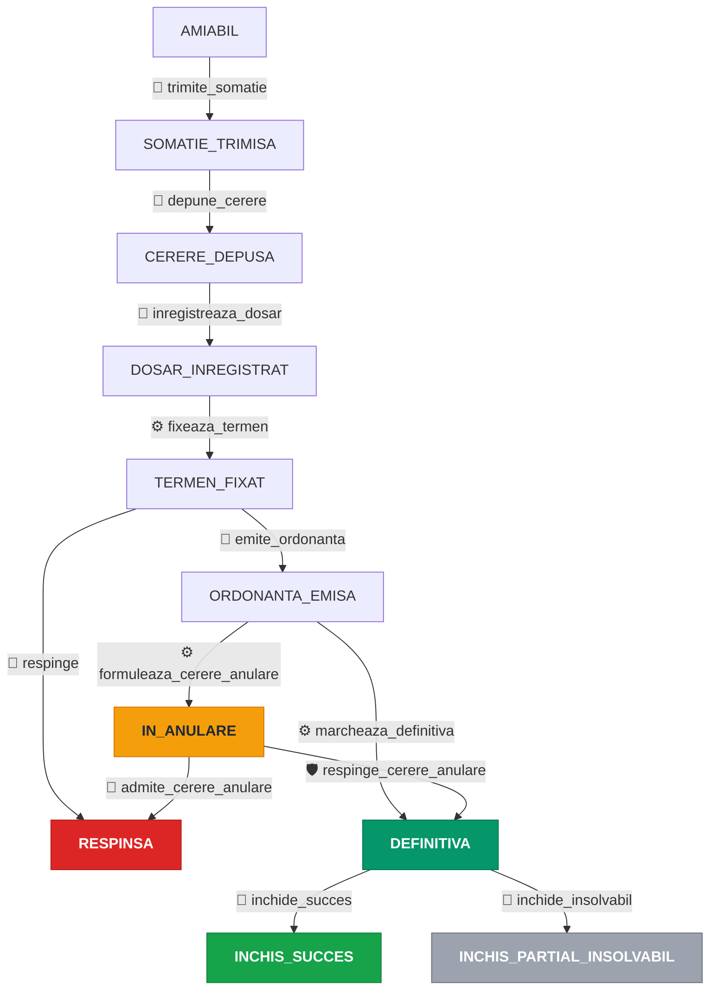

# Workflow dosar ordonanță de plată

## 1. Diagrama workflow-ului

Legendă pentru declanșator:
- 👤 = manual (avocatul apasă un buton din interfață)
- ⚙️ = automat (sistem, fără intervenție)
- 🛡 = admin-only (deocamdată fără buton dedicat în UI avocat; vezi §6)

---

## 2. Cele 11 statusuri ale dosarului

| Status | Etichetă | Ce înseamnă pentru avocat | Terminal? | Monitorizare portal? |
|--------|----------|---------------------------|:---------:|:-------------------:|
| `AMIABIL` | Faza amiabilă | Dosar creat. Creditorul a contactat debitorul pe cale amiabilă; somația încă nu a fost generată. | Nu | Nu |
| `SOMATIE_TRIMISA` | Somație trimisă | Somația de plată (PDF) a fost generată. Avocatul urmează să o comunice debitorului (executor judecătoresc sau Poșta Română cu conținut declarat). | Nu | Nu |
| `CERERE_DEPUSA` | Cerere depusă | Cererea de ordonanță de plată + opisul au fost generate. Avocatul a depus pachetul la registratura instanței competente. | Nu | Nu |
| `DOSAR_INREGISTRAT` | Dosar înregistrat | Avocatul a introdus în aplicație numărul de dosar primit de la instanță (format ECRIS). De aici, sistemul interoghează zilnic portalul. | Nu | **Da** |
| `TERMEN_FIXAT` | Termen fixat | Sistemul a detectat pe portal data ședinței de judecată. Termenul JUDECATA e creat automat. | Nu | **Da** |
| `ORDONANTA_EMISA` | Ordonanță emisă | Instanța a pronunțat o soluție favorabilă. Avocatul a confirmat pronunțarea în aplicație și a introdus data pronunțării. | Nu | **Da** |
| `IN_ANULARE` | În anulare (CPC art. 1024) | Debitorul a formulat cerere în anulare în termenul de 10 zile. Marcarea ca DEFINITIVA e blocată până la soluționarea cererii. | Nu | **Da** |
| `DEFINITIVA` | Definitivă (titlu executoriu) | Ordonanța a rămas definitivă (fie după 10 zile fără cerere în anulare, fie după respingerea cererii). Titlu executoriu obținut. | Nu | Nu |
| `RESPINSA` | Respinsă | Status terminal nefavorabil: instanța a respins cererea OP, sau a admis cererea în anulare formulată de debitor. | **Da** | Nu |
| `INCHIS_SUCCES` | Închis cu succes | Status terminal favorabil: debitorul a achitat integral debitul. | **Da** | Nu |
| `INCHIS_PARTIAL_INSOLVABIL` | Închis parțial / insolvabil | Status terminal: recuperare parțială, debitor insolvabil sau dosar abandonat. | **Da** | Nu |

Sursa codificării: `src/Enum/CaseStatus.php`. Coloana "Monitorizare portal?"
reflectă metoda `isActiveOnPortal()` (cronul zilnic verifică doar dosarele
din aceste 4 statusuri).

---

## 3. Cele 12 tranziții și acțiunile lor

Coloana "Cine declanșează" indică sursa concretă a tranziției: avocatul
din UI, sistemul (cron) sau, pentru `respinge_cerere_anulare`, doar
administratorul (vezi §6). Coloana "Acțiuni sistem" listează ce se
întâmplă automat în aceeași tranzacție.

### 3.1. Faza amiabilă → Somație

#### `trimite_somatie` ✦ AMIABIL → SOMATIE_TRIMISA

| | |
|---|---|
| **Cine declanșează** | 👤 Avocatul apasă „Generează somație" din pagina dosarului |
| **Pre-condiție** | Status = AMIABIL, cel puțin 1 debitor înregistrat, rate-limit nedepășit |
| **Efect juridic** | Marchează intenția procedurală a creditorului. Termenul de 15 zile (CPC art. 1015 alin. 1) curge însă **de la primirea efectivă** a somației de către debitor, nu de la această dată. Comunicarea se face prin executor judecătoresc sau prin Poșta Română (scrisoare recomandată cu confirmare de primire). Alte mijloace (curierat privat, e-mail) pot fi acceptate de unele instanțe dacă produc dovadă certă de primire; practica nu e uniformă |
| **Acțiuni sistem** | 1. Generare PDF somație (`PaymentNoticeGeneratorService`) 2. Setare `LegalCase.paymentNoticeDate = azi` 3. Creare termen `RASPUNS_SOMATIE` (15 zile + disclaimer juridic: avocatul ajustează data după dovada comunicării) 4. Notificare e-mail + in-app: „Somația a fost generată" 5. Intrare în `CaseStatusHistory` + `AuditLog` |
| **Rută HTTP** | `POST /case/{id}/summons/generate` |

#### `depune_cerere` ✦ SOMATIE_TRIMISA → CERERE_DEPUSA

| | |
|---|---|
| **Cine declanșează** | 👤 Avocatul apasă „Generează cerere OP" din pagina dosarului |
| **Pre-condiție** | Status = SOMATIE_TRIMISA, instanța competentă identificată, cererea OP încă nu a fost generată (idempotency strictă) |
| **Efect juridic** | Marchează finalizarea pachetului de depunere. Depunerea efectivă la registratură rămâne o acțiune fizică a avocatului |
| **Acțiuni sistem** | 1. Generare PDF cerere OP (`PaymentOrderRequestGeneratorService`) 2. Generare PDF opis (`OpisGeneratorService`) 3. Disponibil pentru descărcare ca ZIP (cerere + opis + somația) prin `case_zip_package_download` 4. Notificare e-mail + in-app: „Cerere depusă" 5. `CaseStatusHistory` + `AuditLog` |
| **Rută HTTP** | `POST /case/{id}/payment-order/generate` |

#### `inregistreaza_dosar` ✦ CERERE_DEPUSA → DOSAR_INREGISTRAT

| | |
|---|---|
| **Cine declanșează** | 👤 Avocatul introduce numărul de dosar primit de la instanță (format ECRIS). În aplicație există două căi: tab-ul „Activitate Portal" (cu activarea monitorizării) și un formular dedicat din tab-ul „Detalii" |
| **Pre-condiție** | Status = CERERE_DEPUSA, format ECRIS valid |
| **Efect juridic** | Confirmă că instanța a înregistrat cererea. De aici începe urmărirea procedurală în portalul instanței |
| **Acțiuni sistem** | 1. Setare `LegalCase.courtCaseNumber` + `portalMonitoringActive = true` 2. Verificare imediată portal (sincron, în afara tranzacției — nu blochează succesul activării) 3. `CaseStatusHistory` + `AuditLog` |
| **Rute HTTP** | `POST /case/{id}/portal/activate` (cu monitorizare) sau `POST /case/{id}/transition/register` (doar număr dosar) |

### 3.2. Faza de judecată

#### `fixeaza_termen` ✦ DOSAR_INREGISTRAT → TERMEN_FIXAT

| | |
|---|---|
| **Cine declanșează** | ⚙️ Sistemul, automat, când cronul detectează un termen de judecată pe portalul instanței |
| **Pre-condiție** | Eveniment `HEARING_SCHEDULED` cu dată structurată detectat pe portal |
| **Efect juridic** | Marchează existența unui termen de judecată cunoscut. Termenele suplimentare (al doilea, al treilea termen) sunt înregistrate ca deadlines fără retranziție |
| **Acțiuni sistem** | 1. Aplică tranziția doar dacă starea curentă o permite (idempotent) 2. Creare termen `JUDECATA` cu data ședinței prorogată la ziua lucrătoare (CPC art. 181 alin. 2) 3. Notificare in-app + e-mail „Eveniment nou pe portal" (declanșat de detector, nu de tranziție) 4. `CaseStatusHistory` + `AuditLog` |
| **Origine tehnică** | Cron `app:portal-check-all` (zilnic) → `MonitoringEventApplier::onHearingScheduled()` |

#### `emite_ordonanta` ✦ TERMEN_FIXAT → ORDONANTA_EMISA

| | |
|---|---|
| **Cine declanșează** | 👤 Avocatul, manual, după ce verifică textul soluției pe portal. Sistemul **nu** aplică tranziția automat (decizie produs + revizie juridică: o aplicare greșită ar declanșa termenul critic de 10 zile pe date eronate) |
| **Pre-condiție** | Status = TERMEN_FIXAT, data pronunțării valid completată |
| **Efect juridic** | Confirmă pronunțarea unei soluții favorabile creditorului. Atenție: **NU** marchează ordonanța ca definitivă — pentru asta există termenul de 10 zile (CPC art. 1024) |
| **Acțiuni sistem** | 1. Setare `LegalCase.finalRulingDate` 2. Creare termen `CERERE_IN_ANULARE` (10 zile), dar **doar dacă** `rulingCommunicationDate` e setat (la pronunțare avocatul încă nu o are; o va completa ulterior din modul „Detalii") 3. Notificare e-mail + in-app: „Ordonanță emisă" (variantă success) 4. `CaseStatusHistory` + `AuditLog` |
| **Rută HTTP** | `POST /case/{id}/transition/issue-ruling` |
| **Sugestie portal** | Cronul portalului poate detecta `RULING_ISSUED` și logează o propunere de tranziție (advisory). Avocatul vede propunerea și confirmă manual din UI |

#### `respinge` ✦ TERMEN_FIXAT → RESPINSA

| | |
|---|---|
| **Cine declanșează** | 👤 Avocatul, manual, după confirmarea soluției pe portal. Sistemul **nu** aplică automat (terminal — decizie ireversibilă) |
| **Pre-condiție** | Status = TERMEN_FIXAT, motiv selectat (RejectReason) |
| **Efect juridic** | Dosar terminat în defavoarea creditorului. Calea de atac (apel sau cerere în anulare conform soluției) rămâne la dispoziția avocatului în afara fluxului LexRecovery |
| **Acțiuni sistem** | 1. Mascare CNP din câmpul liber „detalii" înainte de persistare (defense-in-depth GDPR) 2. Notificare e-mail + in-app: „Dosar respins" (variantă warning) 3. `CaseStatusHistory` + `AuditLog` |
| **Rută HTTP** | `POST /case/{id}/transition/reject` (când statusul curent = TERMEN_FIXAT) |

### 3.3. Cale alternativă: cerere în anulare

#### `formuleaza_cerere_anulare` ✦ ORDONANTA_EMISA → IN_ANULARE

| | |
|---|---|
| **Cine declanșează** | ⚙️ Sistemul, automat, când cronul portalului detectează depunerea unei cereri în anulare de către debitor |
| **Pre-condiție** | Eveniment `APPEAL_FILED` (câmp structurat din portal) |
| **Efect juridic** | **Protectiv**: previne marcarea prematură ca DEFINITIVA. Cronul `marcheaza_definitiva` nu mai operează pe acest dosar |
| **Acțiuni sistem** | 1. Notificare „Eveniment nou pe portal" + status entered (nu există e-mail specific pentru IN_ANULARE — avocatul vede schimbarea în UI) 2. `CaseStatusHistory` + `AuditLog` cu categoria `portal_monitoring` |
| **Origine tehnică** | Cron `app:portal-check-all` → `MonitoringEventApplier::onAppealFiled()` |

#### `admite_cerere_anulare` ✦ IN_ANULARE → RESPINSA

| | |
|---|---|
| **Cine declanșează** | 👤 Avocatul, manual, după ce instanța a admis cererea în anulare a debitorului |
| **Pre-condiție** | Status = IN_ANULARE, motiv selectat |
| **Efect juridic** | Ordonanța inițială e desființată. Dosar terminal în defavoarea creditorului |
| **Acțiuni sistem** | Identic cu `respinge`: mascare CNP în detalii, notificare warning, `CaseStatusHistory` + `AuditLog` |
| **Rută HTTP** | `POST /case/{id}/transition/reject` (când statusul curent = IN_ANULARE; ruta e partajată, tranziția se alege după status) |

#### `respinge_cerere_anulare` ✦ IN_ANULARE → DEFINITIVA  ⚠ vezi §6

| | |
|---|---|
| **Cine declanșează** | 🛡 Doar administratorul (interfața `/admin/case/{id}/change-status`). În UI avocatului nu există încă buton dedicat — vezi GAP-ul cunoscut din §6 |
| **Pre-condiție** | Status = IN_ANULARE |
| **Efect juridic** | Cererea în anulare a debitorului a fost respinsă. Ordonanța rămâne definitivă, titlu executoriu obținut |
| **Acțiuni sistem** | Notificare „Definitivă" (variantă success) + `CaseStatusHistory` + `AuditLog` |
| **Sugestie portal** | Cronul detectează propunerea pe text și logează un audit advisory; tranziția nu se aplică automat |

### 3.4. Finalizarea definitivă

#### `marcheaza_definitiva` ✦ ORDONANTA_EMISA → DEFINITIVA

| | |
|---|---|
| **Cine declanșează** | ⚙️ Sistemul, automat, când termenul de 10 zile (CPC art. 1024) expiră fără ca debitorul să fi formulat cerere în anulare |
| **Pre-condiție** | Status = ORDONANTA_EMISA **și** `rulingCommunicationDate` completat **și** `azi ≥ ziua_lucrătoare(communicationDate + 10 zile) + 1 zi buffer` (buffer de siguranță: o zi în plus e preferabilă unei tranziții premature) |
| **Efect juridic** | Ordonanța devine titlu executoriu. Termenul de prescripție pentru executarea silită începe să curgă (3 ani, CPC art. 706 alin. 1) |
| **Acțiuni sistem** | 1. Aplicare tranziție 2. Notificare e-mail + in-app: „Ordonanță definitivă" (variantă success) 3. `CaseStatusHistory` + `AuditLog` cu categoria `auto_finalized` 4. **Dacă `rulingCommunicationDate` lipsește**: tranziția se sare, iar sistemul trimite avocatului notificare „Completează data comunicării" (`MissingCommunicationDateEvent`) |
| **Origine tehnică** | Cron `app:check-deadlines` (zilnic dimineața) → `CaseAutoFinalizer::process()` |

#### `inchide_succes` ✦ DEFINITIVA → INCHIS_SUCCES

| | |
|---|---|
| **Cine declanșează** | 👤 Avocatul, manual, când confirmă plata integrală a debitului |
| **Pre-condiție** | Status = DEFINITIVA, motiv = `PAID_AMICABLY` |
| **Efect juridic** | Dosar terminal favorabil. Recuperare integrală |
| **Acțiuni sistem** | Mascare CNP în detalii + `CaseStatusHistory` + `AuditLog` cu categoria `case_closed` |
| **Rută HTTP** | `POST /case/{id}/transition/close` (motiv = `PAID_AMICABLY`) |

#### `inchide_insolvabil` ✦ DEFINITIVA → INCHIS_PARTIAL_INSOLVABIL

| | |
|---|---|
| **Cine declanșează** | 👤 Avocatul, manual |
| **Pre-condiție** | Status = DEFINITIVA, motiv ∈ {`PARTIAL_RECOVERY`, `DEBTOR_INSOLVENT`, `ABANDONED`} |
| **Efect juridic** | Dosar terminal parțial. Titlul executoriu rămâne valabil pentru o eventuală repunere în executare în termenul de prescripție (CPC art. 706 alin. 1 — 3 ani, susceptibili de suspendare/întrerupere). După expirare, titlul nu mai poate fi pus în executare |
| **Acțiuni sistem** | Identic cu `inchide_succes`: mascare CNP, `CaseStatusHistory`, `AuditLog` |
| **Rută HTTP** | `POST /case/{id}/transition/close` (motiv ∈ cele trei de mai sus; ruta e partajată) |

---

## 4. Cele 5 faze ale procedurii OP

### Faza 1: Amiabil
**Status**: AMIABIL. Dosarul a fost creat în aplicație, fie manual de avocat,
fie prin wizardul de creare. Documentele justificative sunt încărcate
(facturi, contracte, dovezi de notificare anterioară). Niciun termen nu
curge la nivel procedural. Avocatul are libertatea să discute cu debitorul
înainte de a declanșa fluxul de OP.

### Faza 2: Somația (CPC art. 1015)
**Status**: SOMATIE_TRIMISA. La apăsarea „Generează somație", sistemul
produce PDF-ul, marchează data și creează termenul de 15 zile pentru
răspuns. **Atenție juridică**: termenul real curge de la **primirea**
somației, nu de la generare. De aceea termenul afișat poartă disclaimer-ul
„estimat" și trebuie ajustat după dovada comunicării. Mijlocul de
comunicare trebuie să producă dovadă certă de primire: în practica
majoritară a instanțelor se folosește executor judecătoresc sau Poșta
Română cu scrisoare recomandată cu confirmare de primire. Curieratul privat
și e-mailul sunt acceptate doar de unele instanțe, cu prudență; verificați
practica instanței competente.

### Faza 3: Cererea de ordonanță (CPC art. 1014)
**Statusuri**: CERERE_DEPUSA → DOSAR_INREGISTRAT. La apăsarea „Generează
cerere OP", sistemul produce cererea + opisul și le pune la dispoziție într-un
ZIP gata de depus la registratură. Tot în acest ZIP se include și somația.
După depunerea fizică, avocatul revine în aplicație și introduce numărul
ECRIS primit de la instanță; din acest moment, sistemul interoghează portalul
zilnic.

### Faza 4: Judecata (CPC art. 1018-1022)
**Statusuri**: TERMEN_FIXAT → ORDONANTA_EMISA (sau RESPINSA). Cronul
portalului detectează ședința și creează termenul JUDECATA în aplicație.
Soluția pronunțată **nu este aplicată automat** ca tranziție: avocatul
trebuie să confirme manual `emite_ordonanta` sau `respinge` după ce
verifică textul. Această alegere conservatoare protejează împotriva
interpretării greșite a textului liber al soluției și împotriva pornirii
unui termen critic de 10 zile pe date eronate.

### Faza 5: Post-pronunțare (CPC art. 1024)
**Statusuri**: ORDONANTA_EMISA → DEFINITIVA → INCHIS_*, cu ramurile
IN_ANULARE și RESPINSA. Aici se joacă două termene paralele:
- 10 zile pentru ca debitorul să formuleze cerere în anulare (CPC art. 1024
  alin. 1);
- 3 ani de prescripție pentru a pune în executare ordonanța, după ce devine
  definitivă (CPC art. 706 alin. 1 — prescripția dreptului de a cere
  executarea silită; termen susceptibil de suspendare și întrerupere conform
  dreptului comun).

Sistemul nu marchează DEFINITIVA până nu are data comunicării ordonanței
către debitor (`rulingCommunicationDate`) — aceasta e singura dată
juridic-corectă de la care curge termenul de 10 zile (CPC art. 1024 alin. 1).
Dacă avocatul uită să o completeze, sistemul îi trimite e-mail de aducere
aminte.

---

## 5. Ce se întâmplă automat la fiecare tranziție

La **fiecare** tranziție reușită, indiferent dacă a fost declanșată manual
sau de cron, sistemul execută trei lucruri obligatorii, în aceeași
tranzacție cu schimbarea statusului:

1. **Audit trail în istoricul dosarului** — o intrare în `CaseStatusHistory`
   cu: statusul vechi, statusul nou, utilizatorul (sau „Sistem"), ora exactă.
   Vizibil în tab-ul „Audit" al paginii dosarului.

2. **Înregistrare în jurnalul de compliance** — o intrare în `AuditLog`
   cu acțiunea (`case_status_change`), ID-ul dosarului, oldData și newData
   serializate. Folosit pentru audit GDPR / audit profesional.

3. **Notificare către avocat** — pentru **5 statusuri "majore"**, sistemul
   trimite automat e-mail + notificare in-app:
   - SOMATIE_TRIMISA (info)
   - CERERE_DEPUSA (info)
   - ORDONANTA_EMISA (success)
   - DEFINITIVA (success)
   - RESPINSA (warning)

   Pentru celelalte statusuri intermediare (DOSAR_INREGISTRAT, TERMEN_FIXAT,
   IN_ANULARE, INCHIS_*) avocatul vede schimbarea în UI dar nu primește
   un e-mail dedicat de tranziție — schimbările sunt vizibile prin canalul
   „Eveniment nou pe portal" în cazul tranzițiilor automate.

În plus, pentru **statusuri specifice**, sistemul crează automat termene
procedurale (`LegalDeadline`):
- la SOMATIE_TRIMISA → termen `RASPUNS_SOMATIE` (15 zile, cu disclaimer);
- la ORDONANTA_EMISA → termen `CERERE_IN_ANULARE` (10 zile, dacă data
  comunicării e setată);
- la crearea dosarului → termen `PRESCRIPTIE` (3 ani, dacă data scadenței
  e setată).

Toate termenele declanșează alerte e-mail + in-app cu 7 / 3 / 1 zile înainte
de expirare (și după, dacă au fost depășite).

---

## 6. GAP cunoscut: `respinge_cerere_anulare`

Tranziția **IN_ANULARE → DEFINITIVA** (în cazul în care instanța respinge
cererea în anulare a debitorului) este definită în workflow, are valoare
enum, traduceri în RO/EN și test automat, dar **nu are încă un buton
dedicat în UI-ul avocatului**.

Concret, după ce instanța respinge cererea în anulare a debitorului,
avocatul trebuie momentan să solicite administratorului LexRecovery să
aplice tranziția din panoul `/admin/case/{id}/change-status`.

Sistemul are deja suportul logic complet (workflow definit, side-effects
configurate — notificare „Definitivă", istoric, audit). Doar UI-ul
avocatului trebuie completat. Va fi adresat într-un pas următor de
dezvoltare; nu necesită modificare de logică juridică.

Pentru context: opusul (`admite_cerere_anulare` — instanța dă dreptate
debitorului, dosarul devine RESPINSA) este implementat și funcțional.

---

## 7. Referințe legale

Procedura ordonanței de plată este reglementată de **Codul de procedură
civilă, art. 1013-1024** (Titlul IX). Articolele relevante pentru calculele
și deciziile sistemului:

| Articol | Subiect | Unde apare în sistem |
|---------|---------|----------------------|
| CPC art. 1013 alin. 1 | Domeniu de aplicare al OP (cine poate cere) | Validatorul de admisibilitate (Pas wizard) |
| CPC art. 1014 alin. 1 | Condițiile creanței: certă, lichidă, exigibilă, dintr-un contract civil | Validatorul de admisibilitate (Pas wizard) |
| CPC art. 1015 alin. 1 | Termenul de 15 zile al somației, curge de la primire | Termenul `RASPUNS_SOMATIE` + disclaimer juridic |
| CPC art. 1018-1022 | Procedura în fața instanței | Fazele 4-5 |
| CPC art. 1024 alin. 1 | Termenul de 10 zile pentru cererea în anulare, curge de la comunicarea ordonanței | `CaseAutoFinalizer` + termenul `CERERE_IN_ANULARE` |
| CPC art. 181 alin. 2 | Prorogarea termenului procedural la prima zi lucrătoare | `WorkingDayResolver` (toate termenele) |
| NCC art. 2517 | Prescripția generală de 3 ani a dreptului material la acțiune | Termenul `PRESCRIPTIE` al creanței (pre-OP) |
| CPC art. 706 alin. 1 | Prescripția dreptului de a cere executarea silită (3 ani de la rămânerea definitivă) | Mențiunea post-DEFINITIVA (§3.4, §4 Faza 5) — termen post-MVP, nu generat încă |
| OUG 80/2013 art. 6 alin. 2 | Taxa de timbru fixă (200 RON pentru OP) | `StampDutyCalculator` |
| OG 13/2011 | Dobânda legală | `InterestCalculatorService` |

---

*Document generat la 28 mai 2026, reflectă starea codului la commit-ul
`6b072d8` (post-Pas 7.2). Sursa-de-adevăr: `config/packages/workflow.yaml`,
`src/Enum/CaseStatus.php`, `src/Enum/CaseTransition.php`, controllerele
din `src/Controller/Case/` și serviciile de cron din `src/Service/Portal/`
și `src/Service/Deadline/`.*
