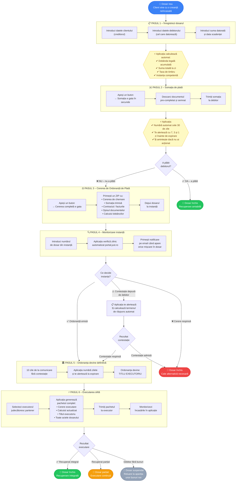
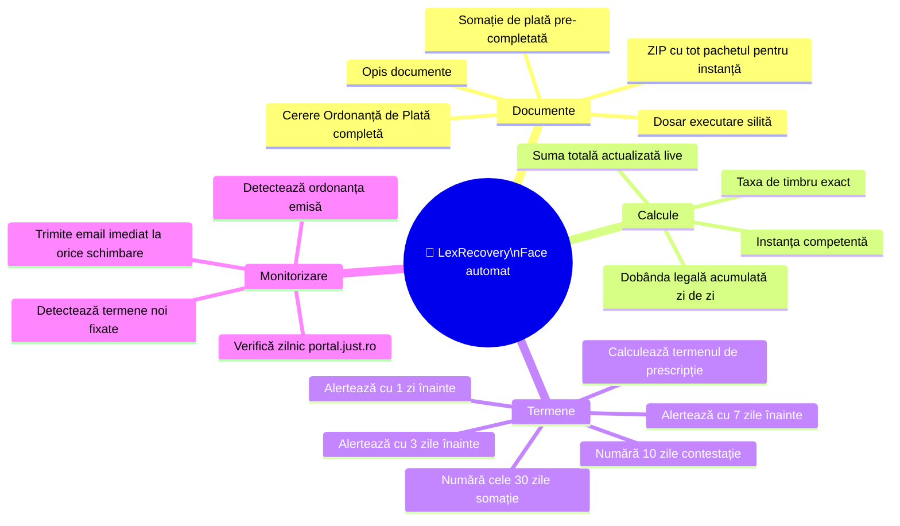
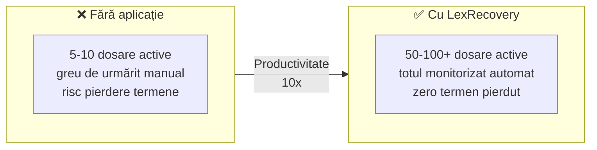
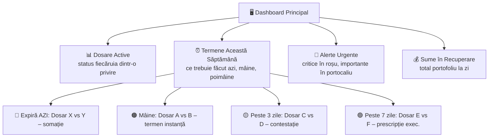
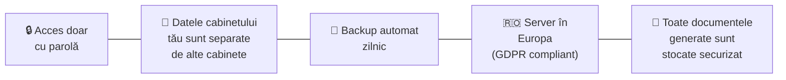

# LexRecovery – Cum Funcționează Aplicația
### Ghid vizual pentru avocați

---

## Ce face aplicația, pe scurt

> LexRecovery automatizează tot procesul de recuperare a creanțelor prin procedura **Ordonanței de Plată** – de la primul contact cu debitorul până la executarea silită. Avocatul introduce datele o singură dată, iar aplicația se ocupă de documente, termene și monitorizare.

---

## Fluxul Complet al unui Dosar

---

## Ce Face Aplicația în Locul Tău

---

## Câte Dosare Poți Gestiona Simultan

---

## Dashboard – Ce Vei Vedea la Prima Autentificare

---

## Siguranța Datelor

---

## Timp Estimat per Dosar

| Activitate | Fără aplicație | Cu LexRecovery |
|---|---|---|
| Redactare somație | 30-45 min | **2 minute** (download PDF) |
| Redactare cerere OP + opis | 2-3 ore | **5 minute** (download ZIP) |
| Calcul dobânzi + taxă timbru | 15-20 min | **Instant** (automat) |
| Verificare portal.just.ro | Zilnic, manual | **Automat** (email la schimbare) |
| Urmărire termene | Agendă manuală | **Automat** (email cu 7/3/1 zile) |
| Dosar executare silită | 1-2 ore | **10 minute** |

---

> **Concluzie:** LexRecovery nu înlocuiește avocatul – judecata juridică, strategia și relația cu clientul rămân ale tale. Aplicația elimină munca repetitivă și administrativă, astfel încât tu să te poți concentra pe dosarele care necesită cu adevărat expertiza ta.
