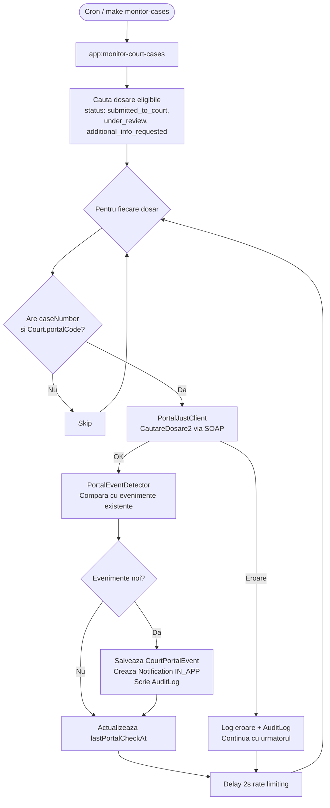

# Monitorizare automata dosare — portal.just.ro

## Descriere

Dupa ce un dosar primeste numar de la instanta (`caseNumber`), aplicatia monitorizeaza automat portalul instantelor (portal.just.ro) pentru a detecta modificari:

- **Termen de judecata fixat** — sedinta programata
- **Sedinta finalizata** — cu solutie/hotarare pronuntata
- **Hotarare pronuntata** — ordonanta sau sentinta emisa
- **Cale de atac declarata** — apel, recurs etc.
- **Actualizare informatii dosar** — schimbare stadiu procesual

Utilizatorul primeste notificari in-app la fiecare eveniment nou detectat.

## Arhitectura

### API portal.just.ro

Portalul ofera un **web service SOAP** la `http://portalquery.just.ro/query.asmx`.

Metoda principala: `CautareDosare2`

| Parametru | Descriere |
|-----------|-----------|
| `numarDosar` | Numarul dosarului (ex: `123/211/2026`) |
| `obiectDosar` | Obiectul dosarului |
| `numeParte` | Numele unei parti |
| `institutie` | Codul institutiei (ex: `JudecatoriaCLUJNAPOCA`) |

Raspunsul contine: informatii dosar, parti (`DosarParte`), sedinte (`DosarSedinta`), cai de atac (`DosarCaleAtac`).

### Diagrama flux monitorizare



### Componente

```
src/Service/Portal/
├── PortalJustClient.php        # Client SOAP — apeleaza CautareDosare2
├── PortalJustException.php     # Exceptie custom pentru erori portal
├── PortalEventDetector.php     # Compara date portal cu DB, detecteaza noutati
└── CaseMonitoringService.php   # Orchestrare: client → detector → persist → notify

src/Entity/
├── CourtPortalEvent.php        # Eveniment detectat pe portal
└── (modificat) Court.php       # + portalCode
└── (modificat) LegalCase.php   # + lastPortalCheckAt, portalEvents

src/Enum/
└── PortalEventType.php         # hearing_scheduled, hearing_completed, etc.

src/Command/
├── MonitorCourtCasesCommand.php       # app:monitor-court-cases
└── ImportCourtPortalCodesCommand.php  # app:import-court-portal-codes

src/Repository/
└── CourtPortalEventRepository.php     # Deduplicare + query-uri
```

## Entitate: CourtPortalEvent

| Camp | Tip | Descriere |
|------|-----|-----------|
| `id` | int (PK) | Cheie primara |
| `legalCase` | ManyToOne LegalCase | Dosarul monitorizat |
| `eventType` | PortalEventType enum | Tipul evenimentului |
| `eventDate` | date, nullable | Data evenimentului de pe portal |
| `description` | string(1000) | Descriere human-readable |
| `solutie` | string(500), nullable | Textul complet al solutiei |
| `solutieSumar` | string(255), nullable | Rezumatul solutiei |
| `rawData` | JSON, nullable | Fragmentul SOAP brut (audit) |
| `detectedAt` | DateTimeImmutable | Cand l-am detectat noi |
| `notified` | bool | Daca s-a trimis notificare |
| `createdAt` | DateTimeImmutable | Data crearii inregistrarii |

Index compus pe `(legal_case_id, event_type, event_date)` pentru deduplicare rapida.

## Tipuri evenimente (PortalEventType)

| Valoare | Label | Descriere |
|---------|-------|-----------|
| `hearing_scheduled` | Sedinta programata | Termen de judecata fixat |
| `hearing_completed` | Sedinta finalizata | Sedinta cu solutie pronuntata |
| `ruling_issued` | Hotarare pronuntata | Ordonanta / sentinta emisa |
| `appeal_filed` | Cale de atac declarata | Apel, recurs etc. |
| `case_info_update` | Actualizare informatii | Schimbare stadiu procesual |

## Mapare instante — coduri portal

Fiecare instanta (`Court`) are un camp `portalCode` care corespunde codului din API-ul portal.just.ro.

Exemple:
- `Judecatoria Sector 1 Bucuresti` → `JudecatoriaSECTORUL1BUCURESTI`
- `Tribunalul Bucuresti` → `TribunalulBUCURESTI`
- `Judecatoria Cluj-Napoca` → `JudecatoriaCLUJNAPOCA`

Fisierul `data/court_portal_codes.json` contine maparea. Se importa cu:

```bash
make import-portal-codes
# sau
docker compose exec php php bin/console app:import-court-portal-codes
```

## Comenzi

### `app:monitor-court-cases`

Robotul principal de monitorizare. Interogheaza portal.just.ro pentru fiecare dosar eligibil.

```bash
# Ruleaza pentru toate dosarele eligibile
make monitor-cases

# Ruleaza pentru un singur dosar (debug)
docker compose exec php php bin/console app:monitor-court-cases --case-id=42

# Cu delay custom intre request-uri (default: 2000ms)
docker compose exec php php bin/console app:monitor-court-cases --delay=3000
```

**Dosare eligibile:**
- Status: `submitted_to_court`, `under_review`, sau `additional_info_requested`
- Au `caseNumber` setat (nu NULL)
- Au instanta cu `portalCode` setat
- Ordonate dupa `lastPortalCheckAt` ASC (cele mai vechi verificate primele)

**Comportament:**
- Fiecare dosar e procesat individual — o eroare la un dosar nu opreste celelalte
- Delay de 2 secunde intre request-uri (rate limiting)
- Returnarea codului SUCCESS (0) daca nu sunt erori, FAILURE (1) daca cel putin un dosar a esuat

### `app:import-court-portal-codes`

Importa codurile portal din `data/court_portal_codes.json` in campul `Court.portalCode`.

```bash
make import-portal-codes
```

## Deduplicare

Sistemul nu creeaza evenimente duplicate. `CourtPortalEventRepository::eventExists()` verifica combinatia `(legalCase, eventType, eventDate)` inainte de a crea un eveniment nou.

## Notificari

La fiecare eveniment nou detectat se creeaza o notificare **IN_APP** (nu email) pentru utilizatorul proprietar al dosarului. Notificarea contine:

- **Titlu:** `Actualizare dosar {caseNumber}: {eventType.label}`
- **Mesaj:** Descrierea evenimentului
- **Link:** `/case/{id}`

## Admin

In panoul admin (`/admin`) exista sectiunea **Evenimente portal** (read-only) unde adminul poate vedea toate evenimentele detectate, inclusiv datele brute SOAP.

## Audit trail

Fiecare eveniment detectat genereaza o intrare in `AuditLog`:
- **Actiune:** `portal_event_detected`
- **Date noi:** eventType, eventDate, description

Erorile de comunicare cu portalul genereaza:
- **Actiune:** `portal_query_failed`
- **Date noi:** mesajul erorii

## Workflow — fara auto-tranzitii

Sistemul de monitorizare **doar notifica** — nu schimba automat statusul dosarului. Adminul trebuie sa verifice manual si sa aplice tranzitia corespunzatoare (ex: `accept`, `reject`) din panoul admin.

Ratiune: datele de pe portal pot fi intarziate sau inconsistente. Decizia de tranzitie trebuie validata de un om.

## Configurare cron (productie)

Pentru productie, adaugati un cron job care ruleaza zilnic:

```cron
0 6 * * * cd /path/to/project && php bin/console app:monitor-court-cases >> var/log/portal-monitor.log 2>&1
```

Sau in Docker, adaugati un serviciu cron in `compose.yaml`.

## Dependinte

- **ext-soap** — extensie PHP pentru client SOAP (adaugata in Dockerfile)
- Nu necesita pachete composer suplimentare

## Teste

30 teste dedicate (din 259 total):

| Fisier test | Tip | Ce testeaza |
|-------------|-----|-------------|
| `tests/Enum/PortalEventTypeTest.php` | Unit | Valori enum, labels |
| `tests/Entity/CourtPortalEventTest.php` | Unit | Getters/setters, defaults, toString |
| `tests/Service/Portal/PortalJustClientTest.php` | Unit | Parsare SOAP, erori, raspunsuri goale |
| `tests/Service/Portal/PortalEventDetectorTest.php` | Integration | Detectie sedinte, hotarari, apeluri, deduplicare |
| `tests/Service/Portal/CaseMonitoringServiceTest.php` | Integration | Orchestrare completa, notificari, audit |
| `tests/Command/MonitorCourtCasesCommandTest.php` | Integration | Comanda cu/fara dosare, optiuni |
