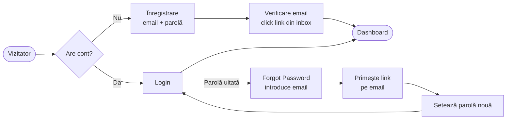
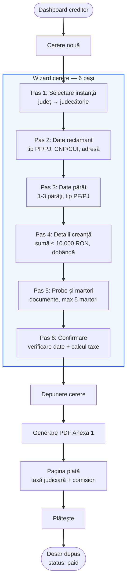
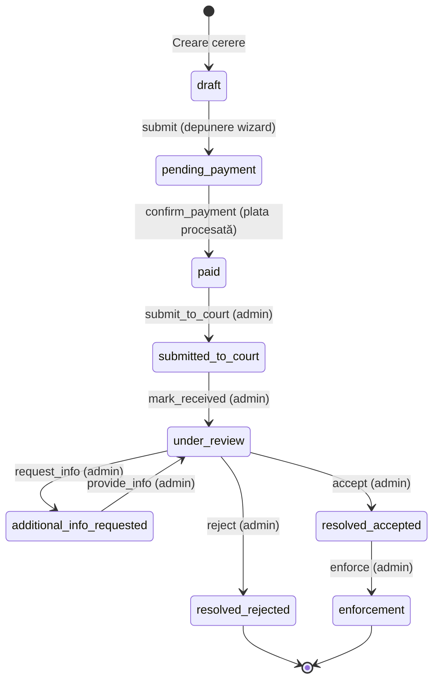
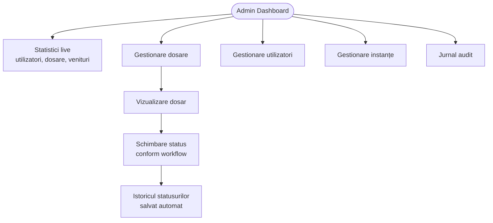
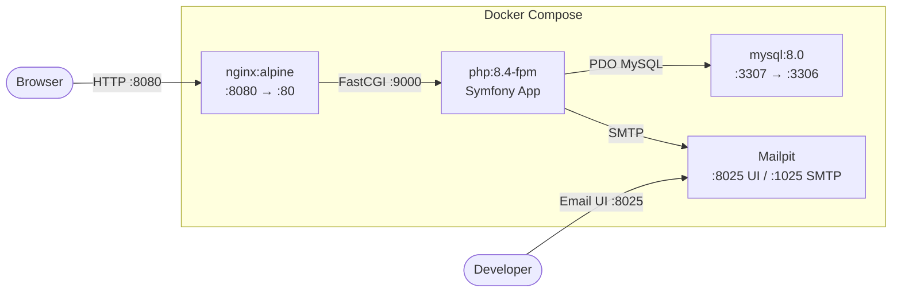
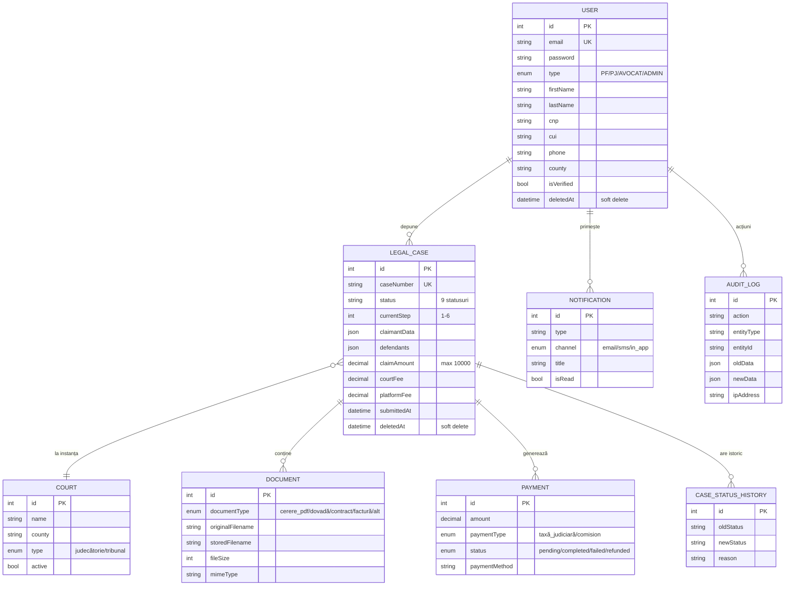

# RecuperareCreanțe — Prezentare MVP

## 1. Prezentare generală

**RecuperareCreanțe** este o platformă web care digitalizează procedura de recuperare a creanțelor cu valoare redusă conform **OUG 80/2013** și **art. 1028-1033 din Codul de Procedură Civilă**.

**Problema:** Depunerea unei cereri cu valoare redusă presupune completarea manuală a formularelor oficiale (Anexa 1), deplasare la instanță, plata taxelor la ghișeu și urmărirea dosarului prin vizite repetate. Procesul este greoi, lent și descurajant.

**Soluția:** Platforma permite creditorilor să completeze cererea online (wizard ghidat 6 pași), să plătească taxa judiciară digital și să urmărească statusul dosarului în timp real — totul dintr-un singur loc.

**Cadru legal:**
- Procedura se aplică creanțelor de **maximum 10.000 RON**
- Exclude: litigii fiscale, de muncă, familie, succesiuni, insolvență, proprietate imobiliară

**Public țintă:** Creditori persoane fizice (PF), persoane juridice (PJ), avocați

---

## 2. Funcționalități implementate

| Categorie | Funcționalitate | Status |
|-----------|----------------|--------|
| **Autentificare** | Înregistrare cu email + parolă | Implementat |
| | Verificare email (link de confirmare) | Implementat |
| | Login cu protecție brute-force (5 încercări/min) | Implementat |
| | Resetare parolă (forgot password cu token) | Implementat |
| | Profil utilizator (vizualizare, editare, schimbare parolă) | Implementat |
| | Comutare limbă RO/EN | Implementat |
| **Wizard cerere** | Pas 1: Selectare instanță (județ + judecătorie) | Implementat |
| | Pas 2: Date reclamant (PF/PJ, CNP/CUI, adresă, avocat) | Implementat |
| | Pas 3: Date pârât (1-3 pârâți, PF/PJ, adresă) | Implementat |
| | Pas 4: Detalii creanță (sumă, descriere, scadență, dobândă) | Implementat |
| | Pas 5: Probe și martori (descriere, până la 5 martori) | Implementat |
| | Pas 6: Confirmare + calcul automat taxe | Implementat |
| **Documente** | Generare PDF cerere (Anexa 1) — DomPDF | Implementat |
| | Upload documente justificative (PDF, JPG, PNG, max 10MB) | Implementat |
| | Download și ștergere documente | Implementat |
| **Plăți** | Calcul automat taxă judiciară (OUG 80/2013) | Implementat |
| | Simulator plăți (pentru dezvoltare) | Implementat |
| | Integrare Netopia (procesor real) | Planificat |
| **Dashboard creditor** | Lista dosarelor proprii cu status și acțiuni | Implementat |
| | Vizualizare detalii dosar | Implementat |
| **Admin** | Dashboard cu statistici live | Implementat |
| | CRUD utilizatori, instanțe | Implementat |
| | Schimbare status dosar (workflow) | Implementat |
| | Jurnal de audit (read-only) | Implementat |
| **Internațional** | Traduceri complete RO + EN (~200 chei) | Implementat |
| **Notificări** | Email-uri tranzacționale + notificări in-app | Planificat |
| **Securitate** | CSP, GDPR, rate limiting extins | Planificat |
| **Deploy** | CI/CD + producție (Coolify) | Planificat |

---

## 3. Fluxuri utilizator

### 3.1 Flux autentificare



**Protecții:**
- Login throttling: max 5 încercări / minut / IP+email
- Email-ul nu este dezvăluit la forgot password (mesaj generic)
- Token de reset expiră automat

### 3.2 Flux depunere cerere (wizard 6 pași)



**Detalii wizard:**
- Fiecare pas salvează progresul (PRG pattern — Post/Redirect/Get)
- Navigare înainte/înapoi păstrează datele
- Câmpurile condiționale: PF/PJ switch, avocat opțional, dobândă opțională
- Selectare instanță cu dropdown cascade: județ → judecătorie (AJAX)
- La depunere: se creează 2 plăți (taxă judiciară + comision platformă) și se generează PDF

### 3.3 State machine — ciclu de viață dosar



**9 statusuri, 9 tranziții.** Fiecare tranziție este auditată automat (CaseStatusHistory + AuditLog).

### 3.4 Flux admin



**Dashboard admin afișează:**
- Utilizatori: total, verificați, neverificați, administratori
- Dosare: per fiecare status (draft, pending_payment, paid, submitted, review, accepted, rejected)
- Financiar: venituri luna curentă

---

## 4. Arhitectură tehnică

### 4.1 Stack tehnologic

| Componenta | Tehnologie | Versiune |
|-----------|-----------|----------|
| Backend | PHP | 8.4 |
| Framework | Symfony | 7.3 |
| Bază de date | MySQL | 8.0 |
| ORM | Doctrine | 3.x |
| Admin | EasyAdmin | 4.29 |
| CSS | Tailwind CSS | v4 (standalone binary) |
| JS | Stimulus + Turbo | via Asset Mapper |
| PDF | DomPDF | 3.x |
| Email (dev) | Mailpit | latest |
| Containerizare | Docker Compose | 4 servicii |

**Zero Node.js** — Tailwind CSS compilat via binary standalone, JavaScript servit prin Asset Mapper + Importmap.

### 4.2 Arhitectură Docker



### 4.3 Structura proiectului

```
src/
├── Controller/
│   ├── Admin/                  # EasyAdmin: Dashboard, User, LegalCase, Court, AuditLog CRUDs
│   │   └── CaseStatusController.php  # Schimbare status dosar (workflow)
│   ├── Case/
│   │   ├── CaseWizardController.php  # Wizard 6 pași + AJAX courts
│   │   ├── DocumentController.php    # Upload/download/delete documente
│   │   └── PaymentController.php     # Pagina plată + simulator
│   ├── DashboardController.php       # Lista dosare creditor
│   ├── HomeController.php            # Homepage
│   ├── LocaleController.php          # Switch RO/EN
│   ├── ProfileController.php         # Profil utilizator
│   ├── RegistrationController.php    # Înregistrare + verificare email
│   ├── ResetPasswordController.php   # Forgot/reset password
│   └── SecurityController.php        # Login/logout
├── Entity/                    # 9 entități Doctrine
├── Enum/                      # 6 enum-uri PHP 8.1+
├── EventSubscriber/           # LocaleSubscriber, CaseWorkflowSubscriber
├── Form/                      # 11 form types (wizard + auth + profil)
├── Repository/                # Repositories cu metode custom
├── Security/
│   ├── CaseVoter.php          # Autorizare per dosar (VIEW/EDIT/UPLOAD)
│   └── EmailVerifier.php      # Helper verificare email
└── Service/
    ├── CaseWorkflowService.php    # Wrapper Symfony Workflow
    ├── PdfGeneratorService.php    # Generare PDF cu DomPDF
    └── TaxCalculatorService.php   # Calcul taxe OUG 80/2013
```

### 4.4 Entități și relații



---

## 5. Securitate

| Măsură | Implementare | Detalii |
|--------|-------------|---------|
| **Login throttling** | `login_throttling` în firewall Symfony | Max 5 încercări/minut per IP+email |
| **CSRF protection** | Token pe toate formularele | Stimulus controller dedicat + Turbo-aware |
| **Autorizare per dosar** | `CaseVoter` (Symfony Voter) | `CASE_VIEW` (owner), `CASE_EDIT` (owner + draft), `CASE_UPLOAD` (owner + draft/pending) |
| **Admin access** | `ROLE_ADMIN` pe `/admin` | Access control în `security.yaml` |
| **Route protection** | `IS_AUTHENTICATED_FULLY` | Pe `/case`, `/dashboard`, `/profile` |
| **Soft deletes** | `deletedAt` pe User, LegalCase | Datele nu sunt șterse fizic |
| **Audit logging** | `AuditLog` entity | Toate tranzițiile workflow + acțiuni CRUD |
| **Email verification** | Token de verificare cu expirare | Obligatoriu înainte de utilizare completă |
| **Parola securizată** | Auto-hashing (bcrypt/argon2) | Symfony `PasswordHasherInterface` |
| **Upload validation** | Tip + dimensiune | Max 10MB, doar PDF/JPG/PNG |

---

## 6. Calcul taxe judiciare (OUG 80/2013)

| Suma pretinsă | Taxă judiciară | Comision platformă | Total |
|--------------|---------------|-------------------|-------|
| 1 — 2.000 RON | 50 RON (fix) | 29,90 RON | 79,90 RON |
| 2.001 — 10.000 RON | 250 + 2% × (sumă - 2.000) RON | 29,90 RON | variabil |

**Exemple de calcul:**

| Sumă | Taxă judiciară | Comision | Total |
|------|---------------|---------|-------|
| 500 RON | 50,00 RON | 29,90 RON | 79,90 RON |
| 2.000 RON | 50,00 RON | 29,90 RON | 79,90 RON |
| 5.000 RON | 310,00 RON | 29,90 RON | 339,90 RON |
| 10.000 RON | 410,00 RON | 29,90 RON | 439,90 RON |

Calculul este implementat în `TaxCalculatorService` cu 8 teste unitare pentru toate cazurile limită.

---

## 7. Teste

**97 teste** în 13 fișiere, acoperind toate modulele aplicației:

| Modul | Fișier test | Teste | Ce acoperă |
|-------|------------|-------|-----------|
| Admin | `AdminAccessTest` | 10 | Dashboard, acces, schimbare status, CSRF |
| Wizard | `CaseWizardControllerTest` | 23 | Toți cei 6 pași, AJAX courts, voters, calcul taxe |
| Documente | `DocumentControllerTest` | 9 | Download, upload, ștergere, validări MIME/size |
| Homepage | `HomeControllerTest` | 4 | Pagina principală, acces anonim/autentificat |
| Plăți | `PaymentControllerTest` | 8 | Pagina plată, simulator, validare status |
| Profil | `ProfileControllerTest` | 6 | Vizualizare, editare, schimbare parolă |
| Reset parolă | `ResetPasswordControllerTest` | 6 | Forgot password, token valid/invalid |
| Voter | `CaseVoterTest` | 10 | VIEW/EDIT/UPLOAD per owner/non-owner/admin |
| Workflow | `CaseWorkflowServiceTest` | 7 | Tranziții, can(), getAvailable() |
| PDF | `PdfGeneratorServiceTest` | 1 | Generare PDF non-vid |
| Taxe | `TaxCalculatorServiceTest` | 8 | Calcul taxe + cazuri limită + excepții |
| Utilizatori test | `CreateTestUsersCommandTest` | 2 | Creare idempotentă |
| Import instanțe | `ImportCourtsCommandTest` | 3 | Import din JSON, idempotent |
| **Total** | **13 fișiere** | **97** | |

Configurație strictă: `failOnDeprecation`, `failOnNotice`, `failOnWarning` = true.

---

## 8. Pași rămași până la lansare

### Pas 17 — Securitate avansată
- **CSP headers** via `nelmio/security-bundle` (Content-Security-Policy, HSTS, X-Frame-Options)
- **Rate limiting extins**: registrare (3/oră/IP), wizard submission (10/oră/user)
- **GDPR**: pagină `/profile/my-data` cu export date (JSON) și ștergere cont (anonimizare)
- **Audit complet**: logging login, schimbare parolă, export date, ștergere cont

### Pas 18 — CI/CD + Deploy
- **GitHub Actions**: test job (PHP 8.4 + MySQL), quality job (PHPStan level 6, PHP-CS-Fixer)
- **Docker producție**: multi-stage build + GitHub Container Registry
- **Hosting**: Hetzner Cloud + Coolify (deploy via webhook)
- **Monitoring**: logs centralizate, health checks

### Planificat post-MVP
- Integrare plăți reale (Netopia)
- Notificări email tranzacționale + in-app
- Formular de răspuns pârât (Anexa 3)
- Înregistrare multi-step cu validare CNP/CUI
- 2FA opțional (scheb/2fa-bundle)
